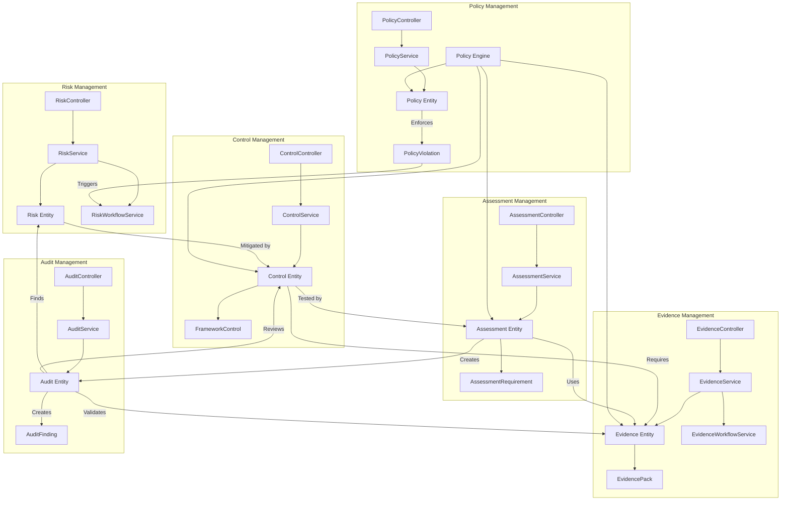
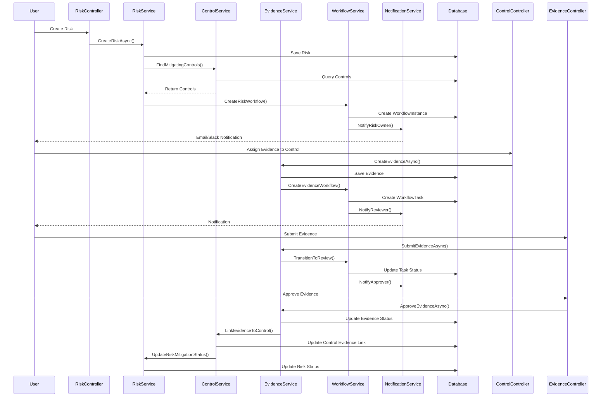
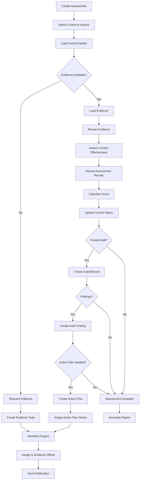
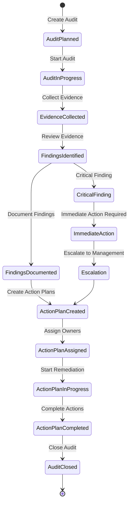
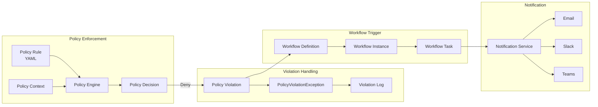
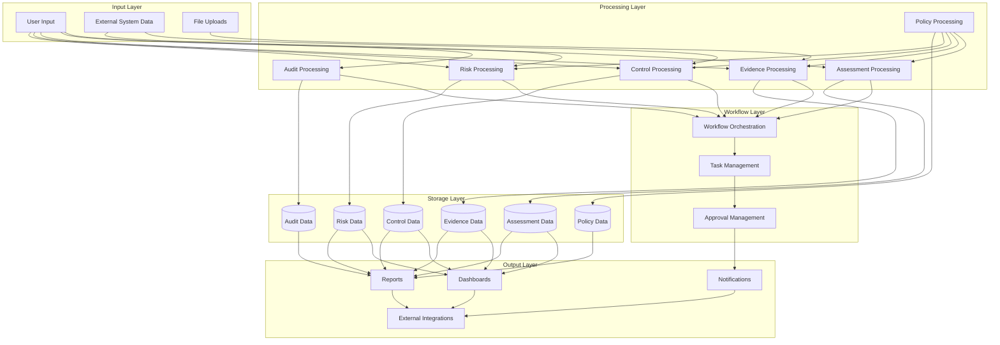
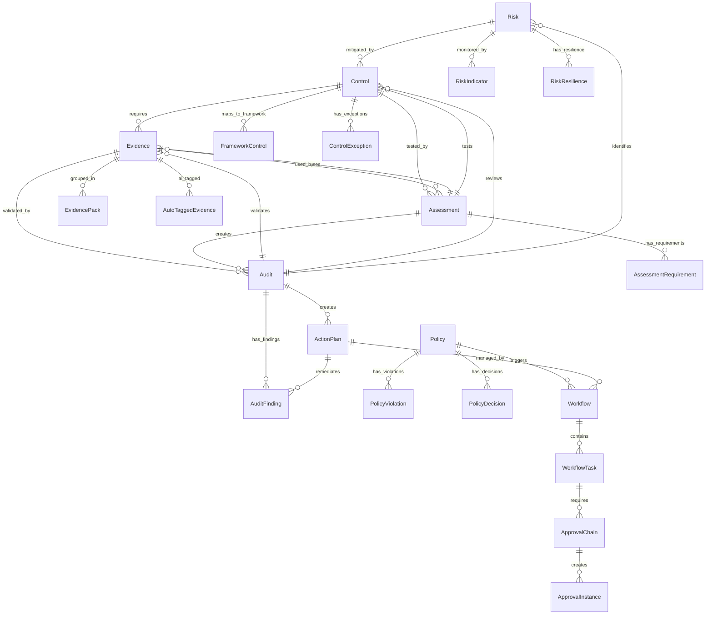
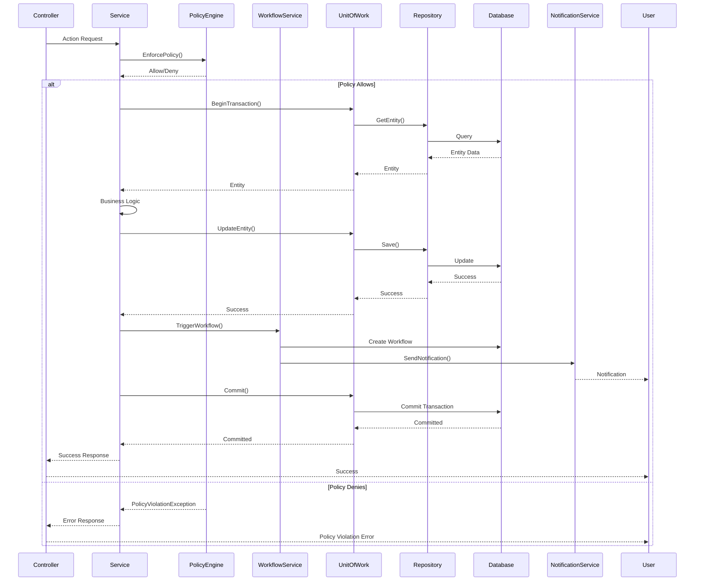
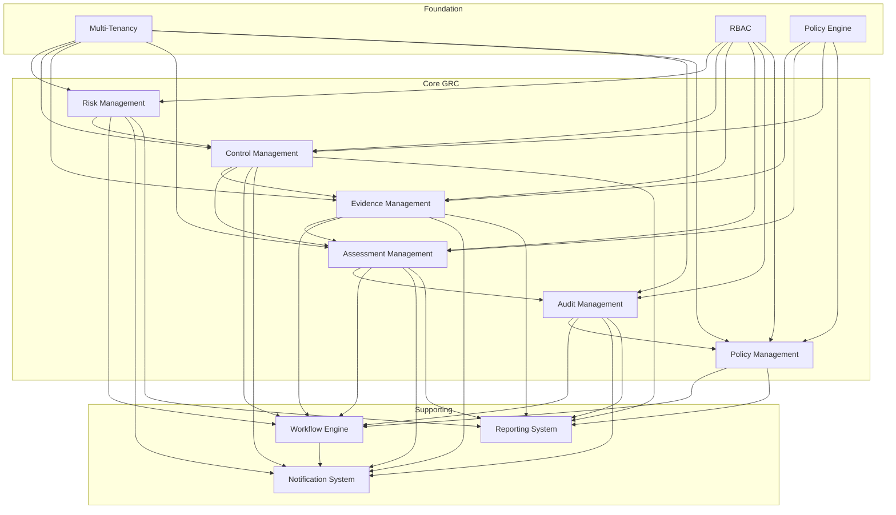
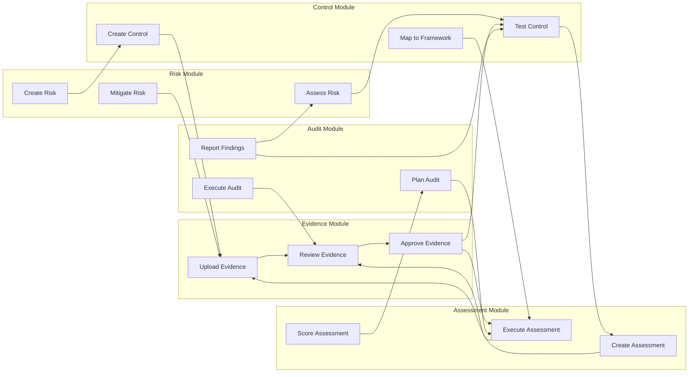

# Core GRC Domain - Feature Connection Diagrams
## Risk, Control, Evidence, Assessment, Audit, Policy Connections

**Generated:** 2025-01-07  
**Focus:** Core GRC domain module interactions and data flows  

---

## 1. Core GRC Module Architecture

---

## 2. Risk → Control → Evidence Flow

---

## 3. Assessment → Control → Evidence Flow

---

## 4. Audit → Finding → Action Plan Flow

---

## 5. Policy → Violation → Workflow Flow

---

## 6. Complete GRC Data Flow

---

## 7. Entity Relationships - Core GRC

---

## 8. Service Interaction Sequence

---

## 9. Feature Dependency Matrix

---

## 10. Cross-Module Data Flow

---

**Last Updated:** 2025-01-07  
**Next:** See [DIAGRAMS_WORKFLOW_SYSTEM.md](./DIAGRAMS_WORKFLOW_SYSTEM.md) for workflow connections
