# Integration & Services - Feature Connection Diagrams
## External Systems, Service Dependencies, and Message Flows

**Generated:** 2025-01-07  
**Focus:** Integration points and service connections  

---

## 1. External System Integrations

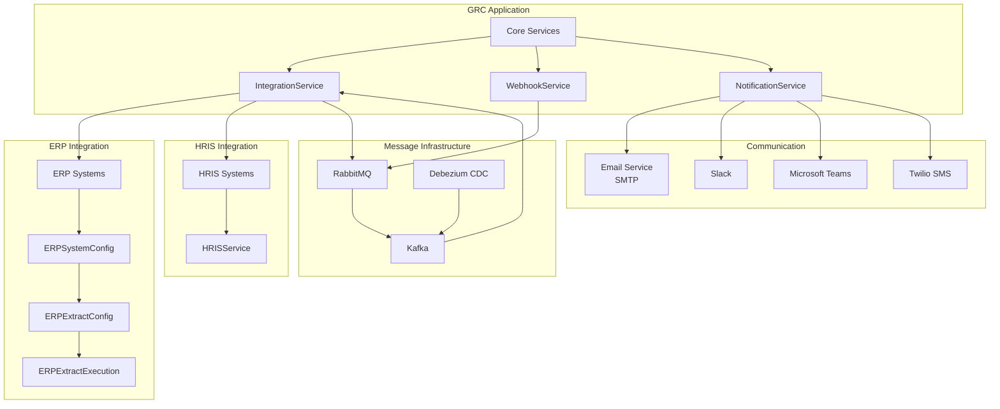

---

## 2. Service Dependency Graph

```mermaid
graph TD
    subgraph "Presentation Layer"
        Controllers[Controllers]
    end
    
    subgraph "Domain Services"
        RiskService[RiskService]
        ControlService[ControlService]
        EvidenceService[EvidenceService]
        AssessmentService[AssessmentService]
        AuditService[AuditService]
        PolicyService[PolicyService]
        WorkflowService[WorkflowService]
    end
    
    subgraph "Infrastructure Services"
        TenantService[TenantService]
        WorkspaceService[WorkspaceService]
        NotificationService[NotificationService]
        IntegrationService[IntegrationService]
        AnalyticsService[AnalyticsService]
    end
    
    subgraph "Supporting Services"
        PolicyHelper[PolicyEnforcementHelper]
        UnitOfWork[UnitOfWork]
        CachingService[CachingService]
        SerialNumberService[SerialNumberService]
    end
    
    subgraph "External Services"
        EmailService[EmailService]
        SlackService[SlackService]
        TeamsService[TeamsService]
        SmsService[SmsService]
        WebhookService[WebhookService]
    end
    
    Controllers --> RiskService
    Controllers --> ControlService
    Controllers --> EvidenceService
    Controllers --> AssessmentService
    Controllers --> AuditService
    Controllers --> PolicyService
    Controllers --> WorkflowService
    
    RiskService --> PolicyHelper
    RiskService --> UnitOfWork
    RiskService --> NotificationService
    RiskService --> TenantService
    
    ControlService --> PolicyHelper
    ControlService --> UnitOfWork
    ControlService --> NotificationService
    ControlService --> TenantService
    
    EvidenceService --> PolicyHelper
    EvidenceService --> UnitOfWork
    EvidenceService --> NotificationService
    EvidenceService --> WorkflowService
    EvidenceService --> TenantService
    
    AssessmentService --> PolicyHelper
    AssessmentService --> UnitOfWork
    AssessmentService --> NotificationService
    AssessmentService --> TenantService
    
    AuditService --> PolicyHelper
    AuditService --> UnitOfWork
    AuditService --> NotificationService
    AuditService --> TenantService
    
    PolicyService --> PolicyHelper
    PolicyService --> UnitOfWork
    PolicyService --> NotificationService
    
    WorkflowService --> UnitOfWork
    WorkflowService --> NotificationService
    WorkflowService --> TenantService
    WorkflowService --> WorkspaceService
    
    NotificationService --> EmailService
    NotificationService --> SlackService
    NotificationService --> TeamsService
    NotificationService --> SmsService
    
    IntegrationService --> WebhookService
    IntegrationService --> NotificationService
    
    UnitOfWork --> CachingService
    WorkflowService --> SerialNumberService
```

---

## 3. Message Queue Flow

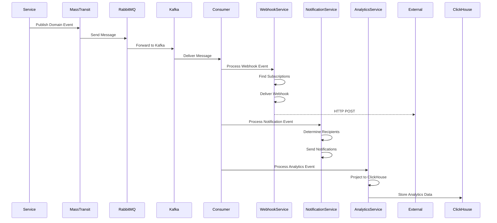

---

## 4. Webhook Delivery Flow

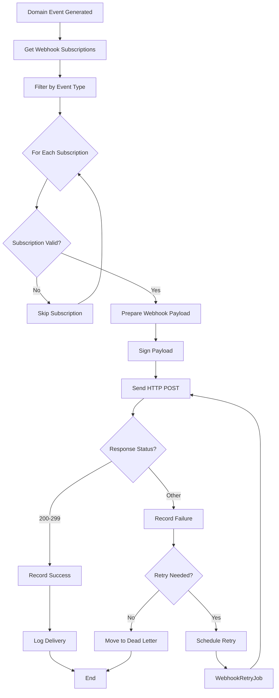

---

## 5. Background Job Connections

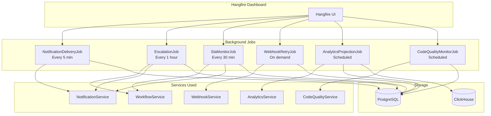

---

## 6. Integration Health Monitoring

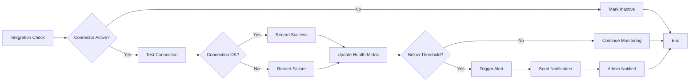

---

## 7. Event-Driven Architecture

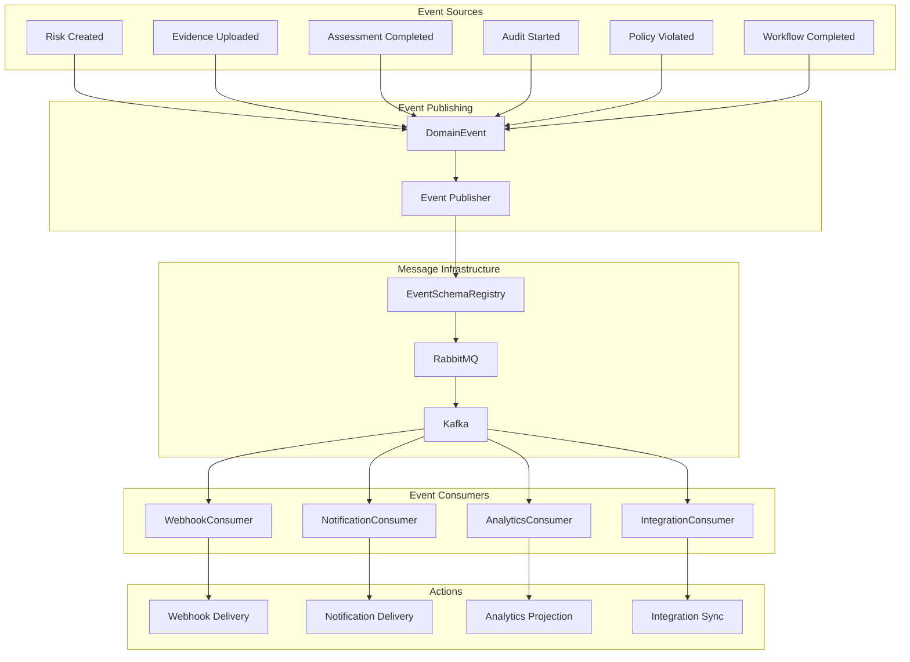

---

## 8. Service Communication Patterns

```mermaid
graph TB
    subgraph "Synchronous Communication"
        ControllerSync[Controller]
        ServiceSync[Service]
        RepositorySync[Repository]
        DatabaseSync[(Database)]
        
        ControllerSync -->|"Direct Call"| ServiceSync
        ServiceSync -->|"Direct Call"| RepositorySync
        RepositorySync -->|"Query"| DatabaseSync
        DatabaseSync -->|"Response"| RepositorySync
        RepositorySync -->|"Return"| ServiceSync
        ServiceSync -->|"Return"| ControllerSync
    end
    
    subgraph "Asynchronous Communication"
        ServiceAsync[Service]
        MassTransitAsync[MassTransit]
        RabbitMQAsync[RabbitMQ]
        ConsumerAsync[Consumer]
        ActionAsync[Action Service]
        
        ServiceAsync -->|"Publish Event"| MassTransitAsync
        MassTransitAsync -->|"Send Message"| RabbitMQAsync
        RabbitMQAsync -->|"Deliver Message"| ConsumerAsync
        ConsumerAsync -->|"Process"| ActionAsync
    end
    
    subgraph "Background Processing"
        HangfireScheduled[Hangfire Scheduled]
        BackgroundJob[Background Job]
        ServiceBackground[Service]
        
        HangfireScheduled -->|"Trigger"| BackgroundJob
        BackgroundJob -->|"Call"| ServiceBackground
    end
```

---

## 9. Integration Entity Relationships

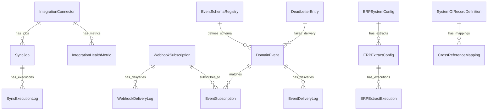

---

## 10. Complete Integration Flow

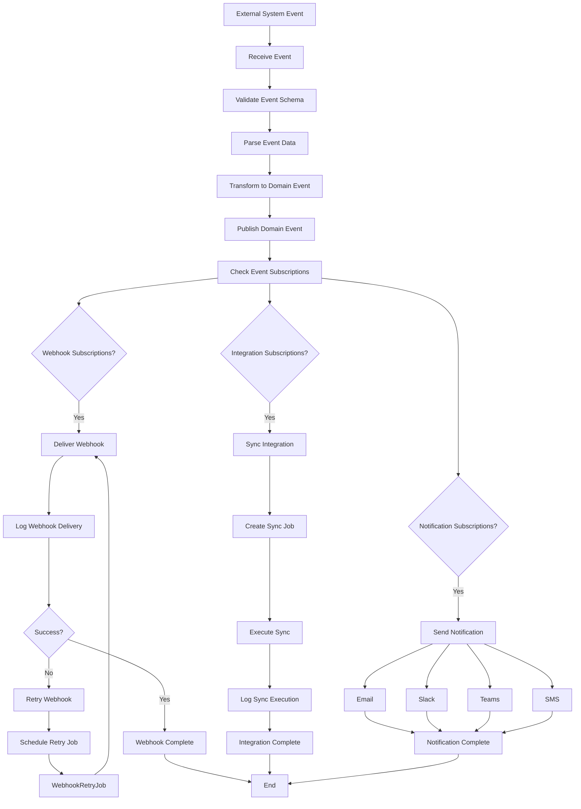

---

## 11. Service Layer Architecture

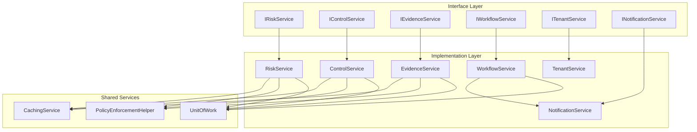

---

## 12. Debezium CDC Flow

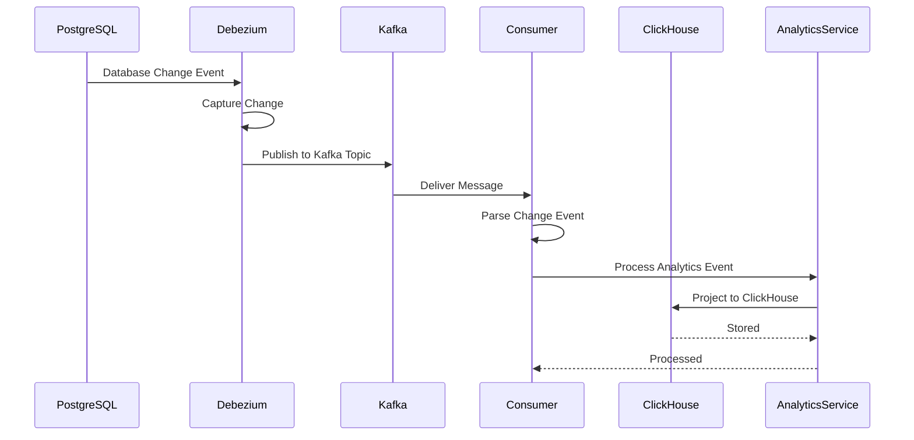

---

**Last Updated:** 2025-01-07  
**Next:** See [DIAGRAMS_ONBOARDING.md](./DIAGRAMS_ONBOARDING.md) for onboarding system flows
