# Onboarding System - Feature Connection Diagrams
## 12-Step Wizard Flow and Provisioning Connections

**Generated:** 2025-01-07  
**Focus:** Onboarding wizard and provisioning flows  

---

## 1. 12-Step Onboarding Wizard Flow

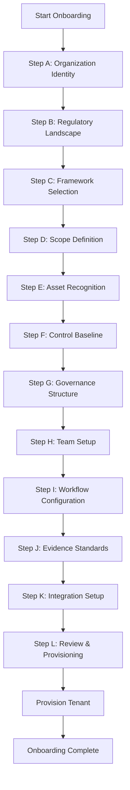

---

## 2. Step Dependencies

```mermaid
graph LR
    StepA[Step A<br/>Organization Identity] --> StepB[Step B<br/>Regulatory Landscape]
    StepB --> StepC[Step C<br/>Framework Selection]
    StepC --> StepD[Step D<br/>Scope Definition]
    StepD --> StepE[Step E<br/>Asset Recognition]
    StepE --> StepF[Step F<br/>Control Baseline]
    StepF --> StepG[Step G<br/>Governance Structure]
    StepG --> StepH[Step H<br/>Team Setup]
    StepH --> StepI[Step I<br/>Workflow Configuration]
    StepI --> StepJ[Step J<br/>Evidence Standards]
    StepJ --> StepK[Step K<br/>Integration Setup]
    StepK --> StepL[Step L<br/>Review & Provisioning]
    
    StepA -.->|"Provides Tenant Info"| StepH
    StepB -.->|"Provides Regulators"| StepC
    StepC -.->|"Provides Frameworks"| StepF
    StepD -.->|"Provides Scope"| StepE
    StepE -.->|"Provides Assets"| StepF
    StepF -.->|"Provides Controls"| StepJ
    StepG -.->|"Provides Governance"| StepI
    StepH -.->|"Provides Teams"| StepI
```

---

## 3. Provisioning Flow

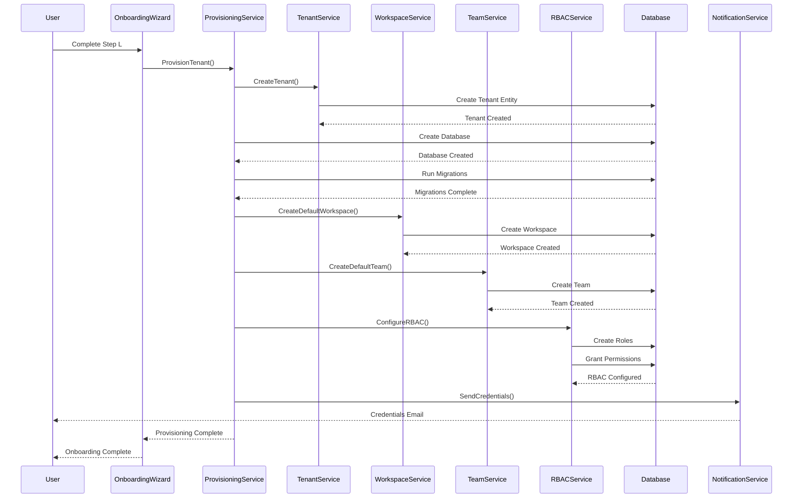

---

## 4. Team Setup Connections

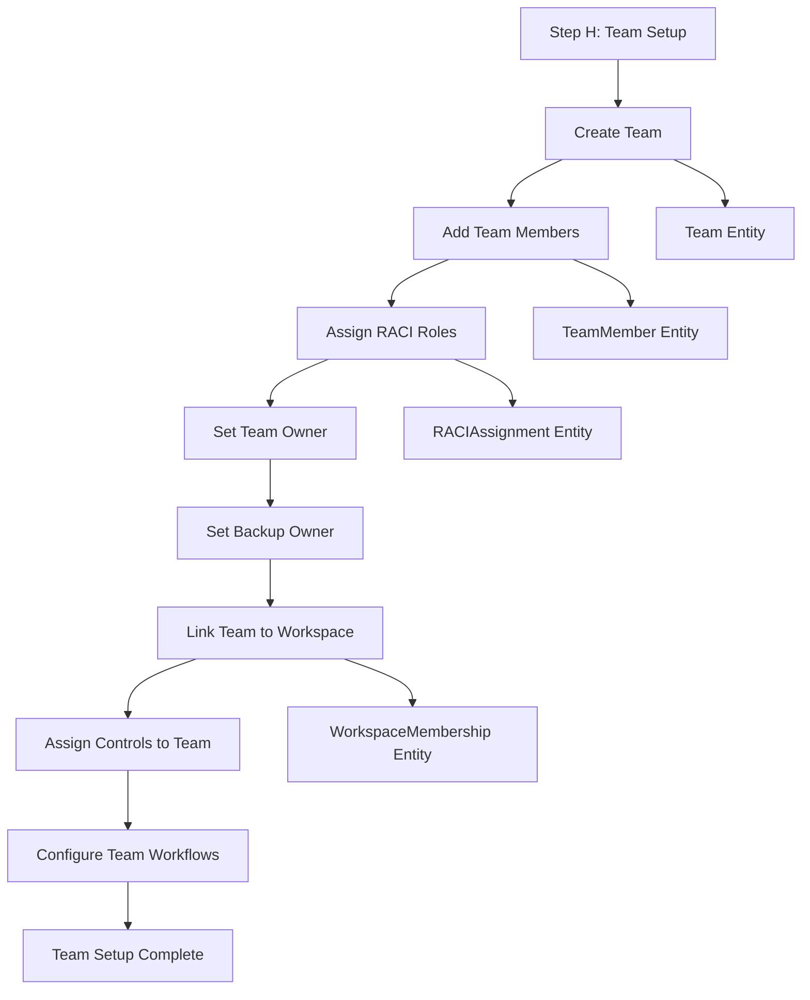

---

## 5. Workspace Creation Flow

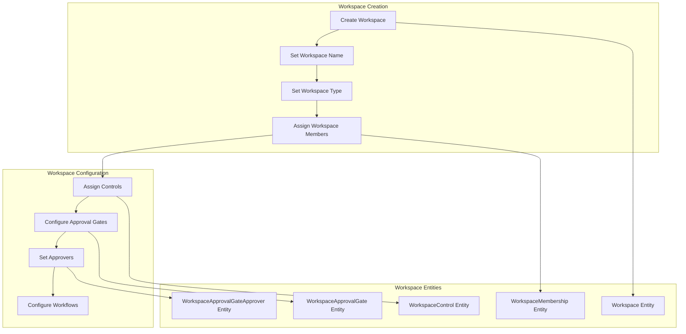

---

## 6. Complete Onboarding Sequence

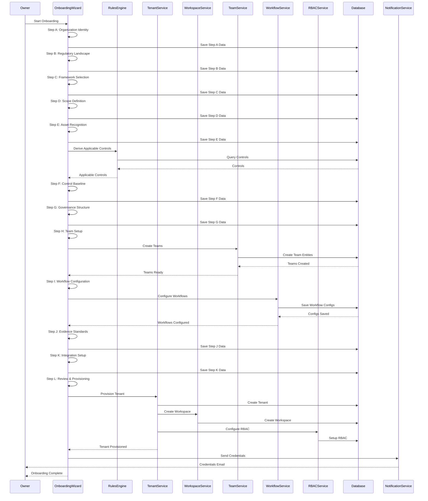

---

## 7. Onboarding Data Flow

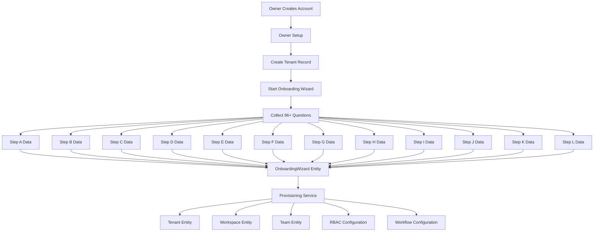

---

## 8. Provisioning Architecture

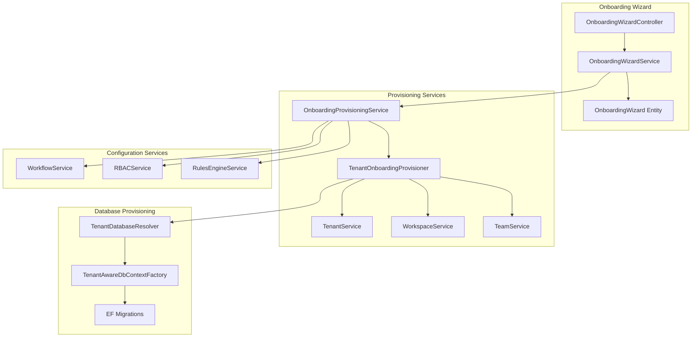

---

## 9. Team and RACI Setup Flow

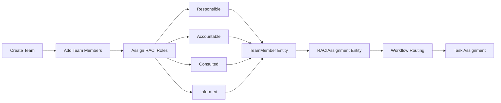

---

## 10. Onboarding Entity Relationships

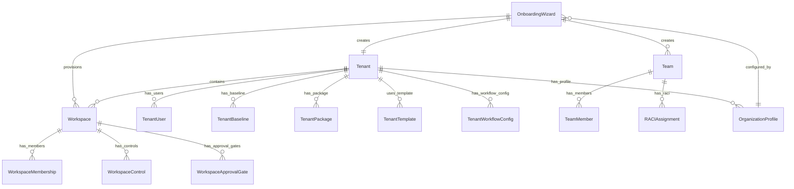

---

## 11. Smart Onboarding Flow

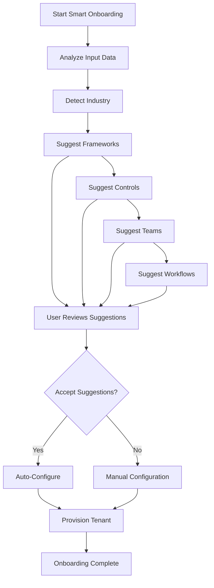

---

## 12. Onboarding to Production Flow

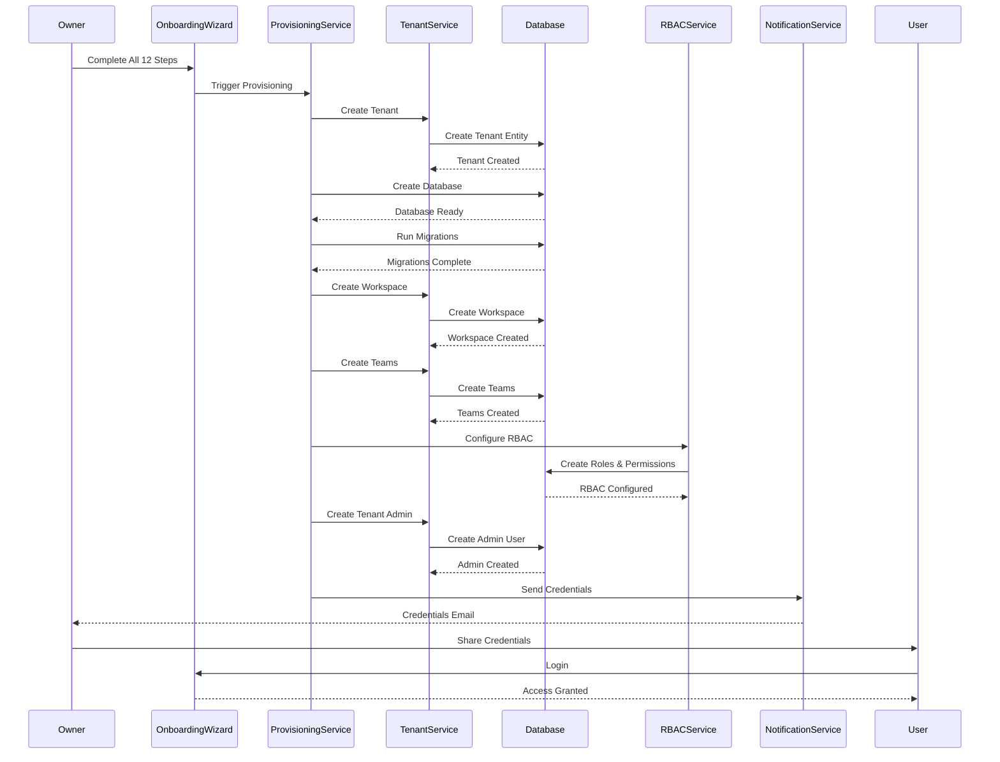

---

**Last Updated:** 2025-01-07  
**Next:** See [DIAGRAMS_DATA_FLOWS.md](./DIAGRAMS_DATA_FLOWS.md) for data flow patterns
