# Shahin AI Platform - Feature Connection Diagrams
## 6-Module Architecture and Interconnections

**Generated:** 2025-01-07  
**Focus:** Shahin AI platform modules and their connections  

---

## 1. Shahin AI 6-Module Architecture

```mermaid
graph TB
    subgraph "Shahin AI Platform"
        Orchestration[ShahinAIOrchestrationService]
    end
    
    subgraph "MAP Module - Control Library"
        MAPService[MAPService]
        CanonicalControl[CanonicalControl]
        FrameworkMapping[Framework Mapping]
        PlainLanguageControl[PlainLanguageControl]
    end
    
    subgraph "APPLY Module - Scope & Applicability"
        APPLYService[APPLYService]
        ApplicabilityMatrix[ApplicabilityMatrix]
        ApplicabilityRule[ApplicabilityRule]
        BaselineOverlay[BaselineOverlayModel]
    end
    
    subgraph "PROVE Module - Evidence & Testing"
        PROVEService[PROVEService]
        AutoTaggedEvidence[AutoTaggedEvidence]
        CapturedEvidence[CapturedEvidence]
        TestProcedure[TestProcedure]
        EvidenceScore[EvidenceScore]
    end
    
    subgraph "WATCH Module - Monitoring & Alerts"
        WATCHService[WATCHService]
        RiskIndicator[RiskIndicator]
        RiskIndicatorMeasurement[RiskIndicatorMeasurement]
        RiskIndicatorAlert[RiskIndicatorAlert]
        GovernanceCadence[GovernanceCadence]
    end
    
    subgraph "FIX Module - Remediation"
        FIXService[FIXService]
        ControlException[ControlException]
        ActionPlan[ActionPlan]
    end
    
    subgraph "VAULT Module - Secure Storage"
        VAULTService[VAULTService]
        CryptographicAsset[CryptographicAsset]
        ComplianceGuardrail[ComplianceGuardrail]
        StrategicRoadmap[StrategicRoadmapMilestone]
    end
    
    Orchestration --> MAPService
    Orchestration --> APPLYService
    Orchestration --> PROVEService
    Orchestration --> WATCHService
    Orchestration --> FIXService
    Orchestration --> VAULTService
    
    MAPService --> CanonicalControl
    MAPService --> FrameworkMapping
    MAPService --> PlainLanguageControl
    
    APPLYService --> ApplicabilityMatrix
    APPLYService --> ApplicabilityRule
    APPLYService --> BaselineOverlay
    
    PROVEService --> AutoTaggedEvidence
    PROVEService --> CapturedEvidence
    PROVEService --> TestProcedure
    PROVEService --> EvidenceScore
    
    WATCHService --> RiskIndicator
    WATCHService --> RiskIndicatorMeasurement
    WATCHService --> RiskIndicatorAlert
    WATCHService --> GovernanceCadence
    
    FIXService --> ControlException
    FIXService --> ActionPlan
    
    VAULTService --> CryptographicAsset
    VAULTService --> ComplianceGuardrail
    VAULTService --> StrategicRoadmap
```

---

## 2. Module Interconnections

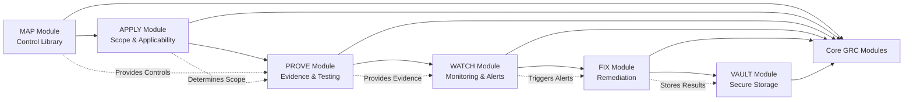

---

## 3. MAP Module - Control Library Flow

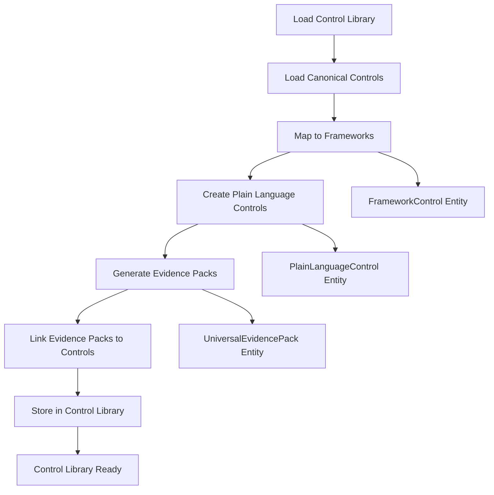

---

## 4. APPLY Module - Scope & Applicability Flow

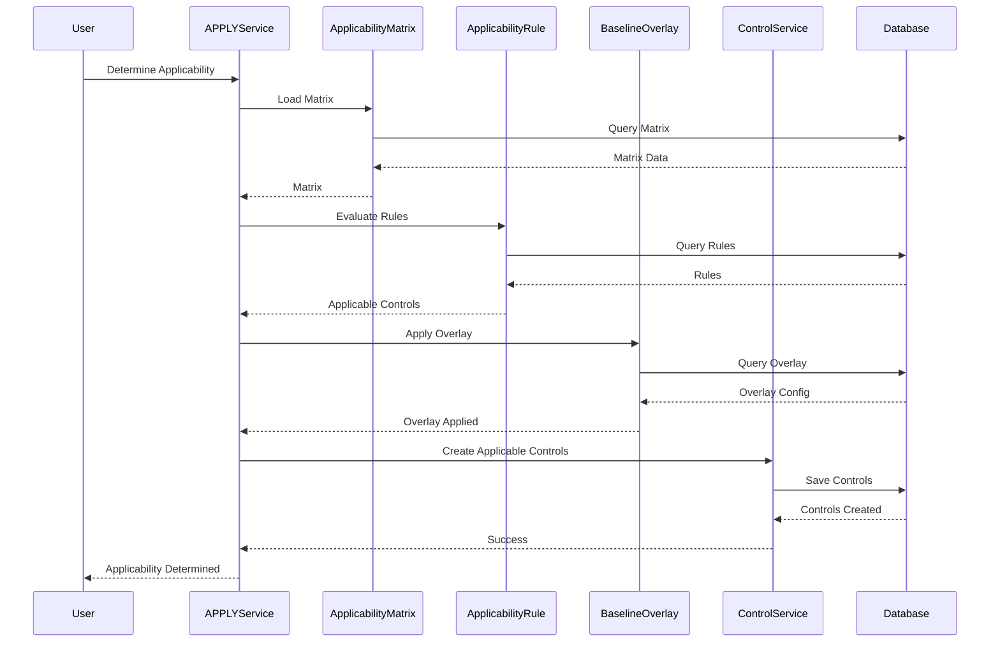

---

## 5. PROVE Module - Evidence & Testing Flow

```mermaid
flowchart LR
    EvidenceUpload[Evidence Uploaded] --> AutoTag[AI Auto-Tagging]
    AutoTag --> AutoTaggedEvidence[AutoTaggedEvidence]
    AutoTaggedEvidence --> EvidenceCapture[Evidence Capture]
    EvidenceCapture --> CapturedEvidence[CapturedEvidence]
    CapturedEvidence --> EvidenceScoring[Evidence Scoring]
    EvidenceScoring --> EvidenceScore[EvidenceScore]
    EvidenceScore --> TestProcedure[Test Procedure]
    TestProcedure --> TestExecution[Test Execution]
    TestExecution --> TestResult[Test Result]
    TestResult --> ControlTest[Control Test]
    ControlTest --> Assessment[Assessment]
```

---

## 6. WATCH Module - Monitoring Flow

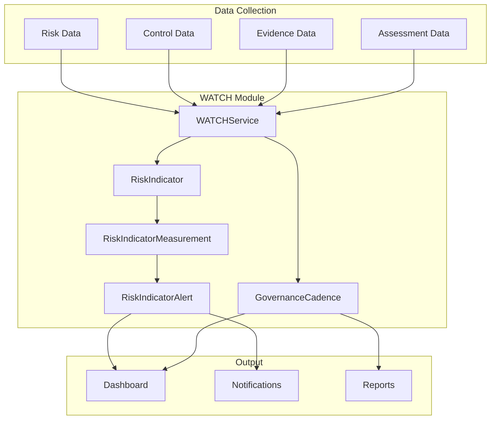

---

## 7. FIX Module - Remediation Flow

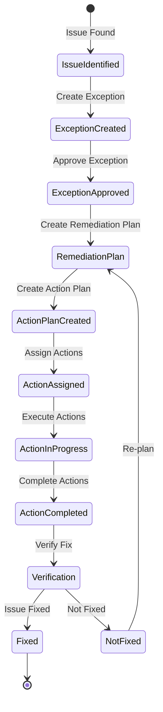

---

## 8. VAULT Module - Secure Storage Flow

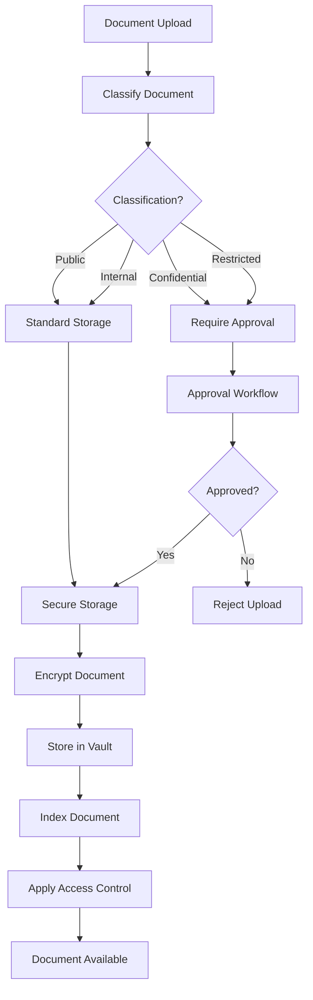

---

## 9. AI Agent System Connections

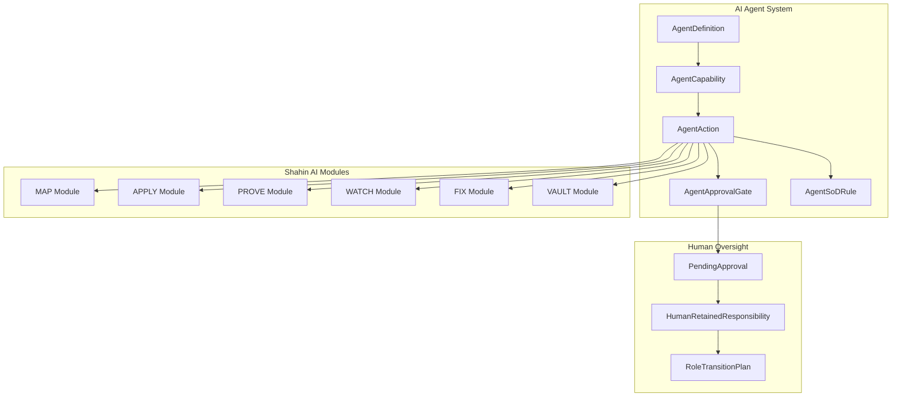

---

## 10. Complete Shahin AI Data Flow

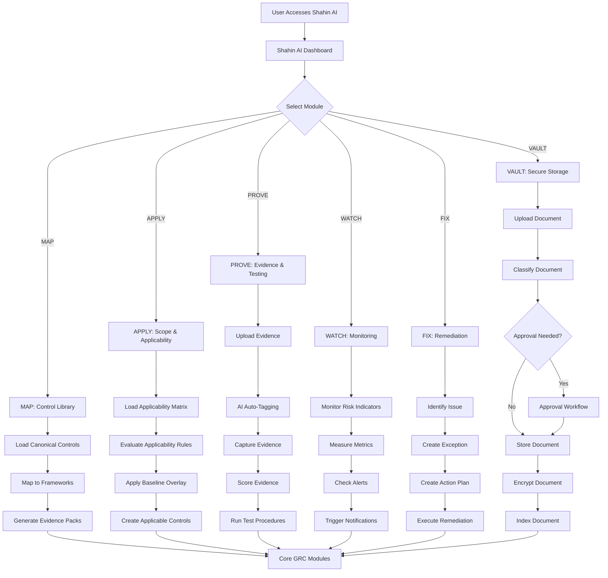

---

## 11. Shahin AI Entity Relationships

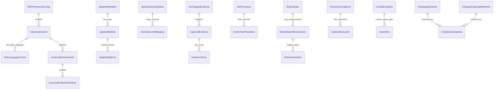

---

## 12. Shahin AI Integration with Core GRC

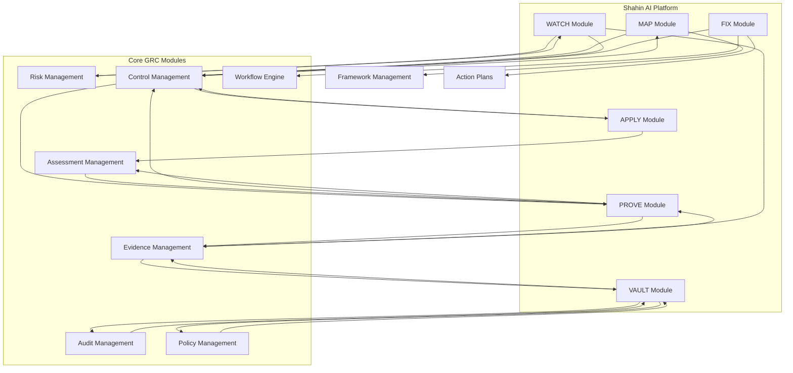

---

**Last Updated:** 2025-01-07  
**Next:** See [DIAGRAMS_INTEGRATIONS.md](./DIAGRAMS_INTEGRATIONS.md) for integration connections
