# Multi-Tenancy & RBAC - Feature Connection Diagrams
## Tenant Hierarchy, Permission Flows, and Access Control

**Generated:** 2025-01-07  
**Focus:** Multi-tenancy architecture and RBAC system connections  

---

## 1. Tenant → Workspace → User Hierarchy

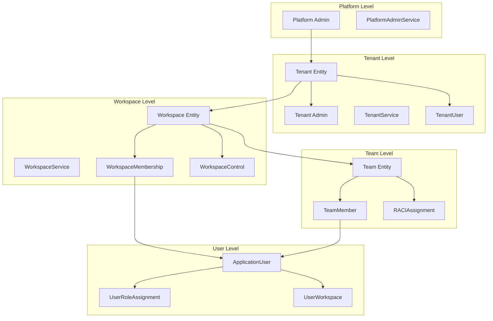

---

## 2. RBAC Permission Flow

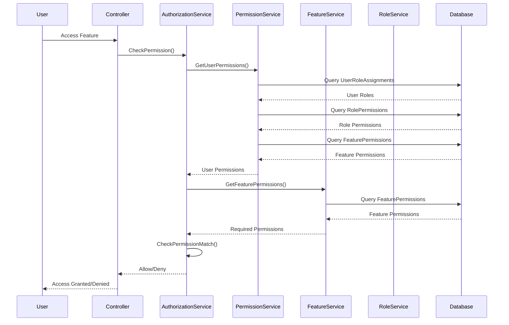

---

## 3. Feature → Permission → Role Mapping

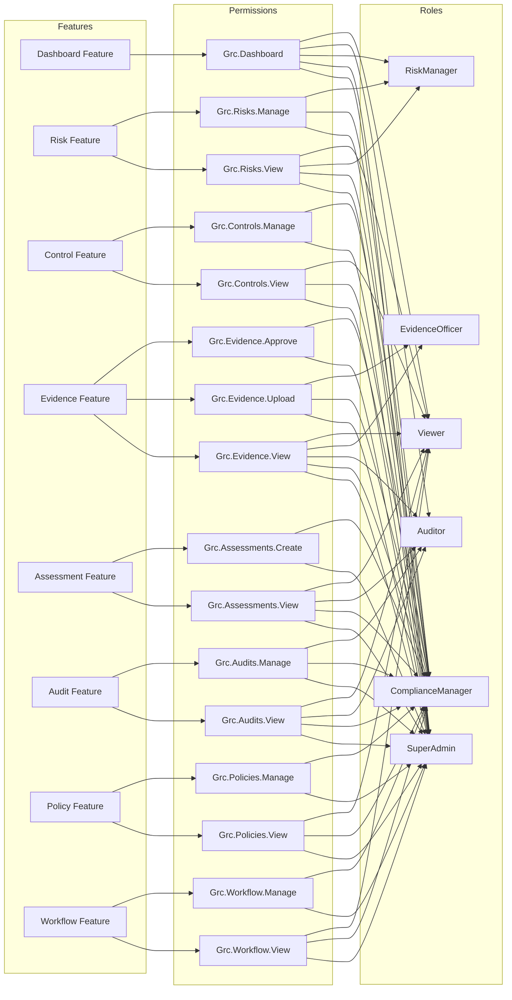

---

## 4. Menu Visibility Based on Permissions

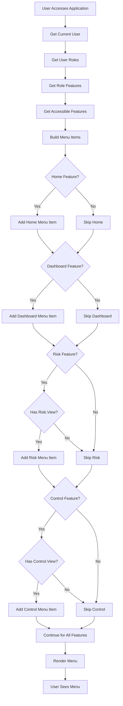

---

## 5. Tenant Isolation Architecture

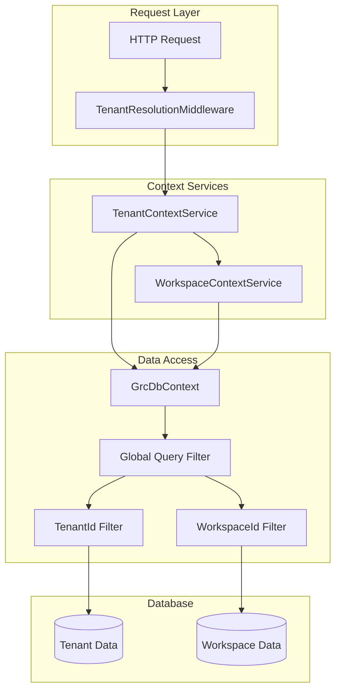

---

## 6. Permission Evaluation Flow

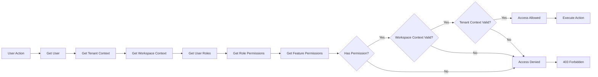

---

## 7. Role Assignment Flow

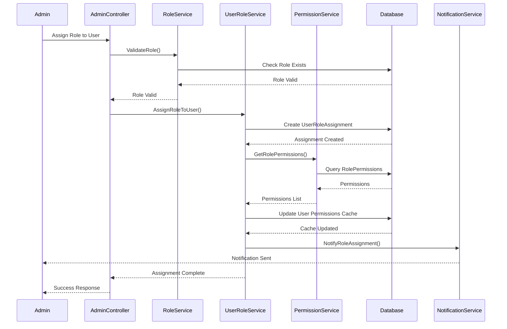

---

## 8. Tenant Provisioning Flow

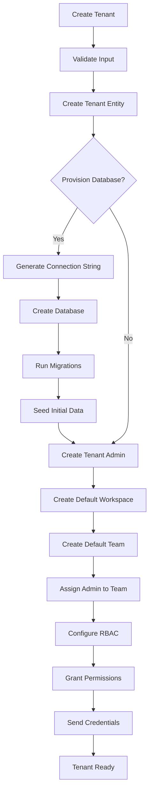

---

## 9. Workspace Scoping Flow

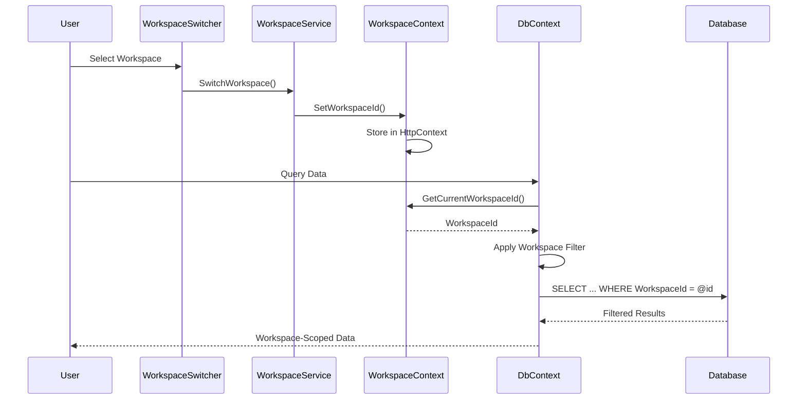

---

## 10. RBAC Entity Relationships

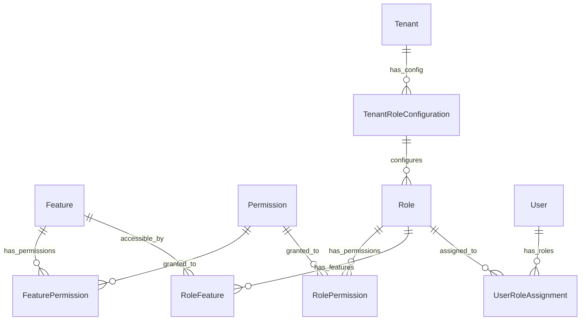

---

## 11. Complete Access Control Flow

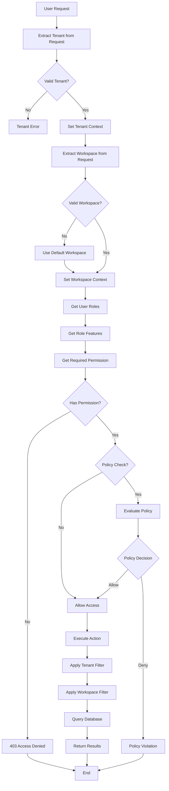

---

## 12. Multi-Tenant Data Isolation

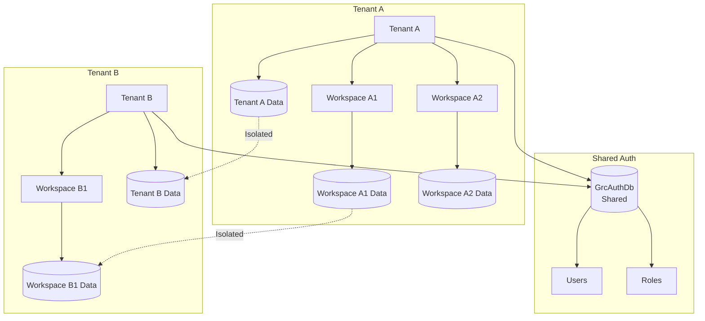

---

**Last Updated:** 2025-01-07  
**Next:** See [DIAGRAMS_SHAHIN_AI.md](./DIAGRAMS_SHAHIN_AI.md) for Shahin AI platform architecture
