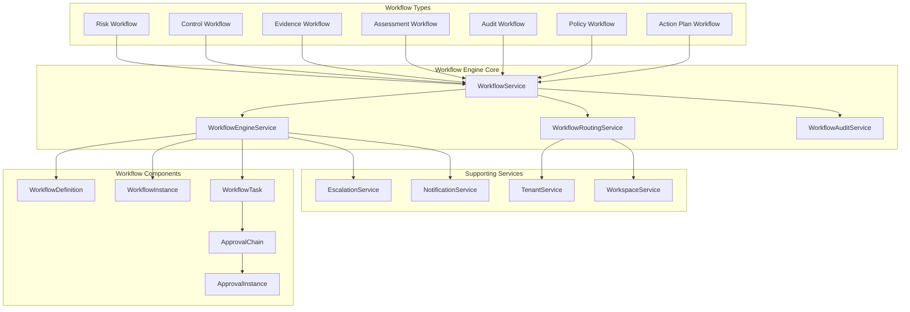
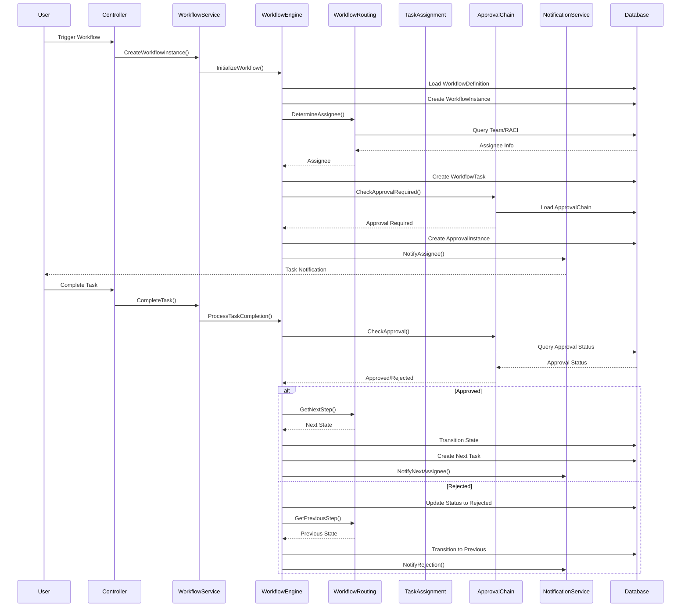
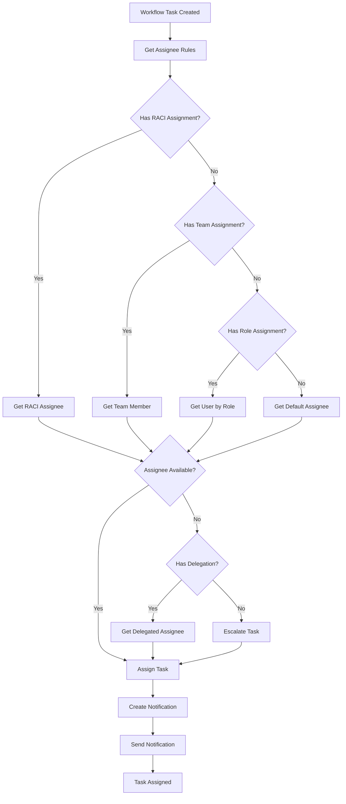
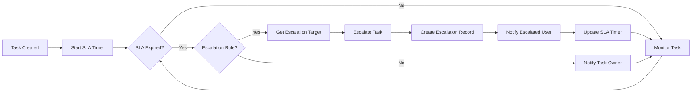
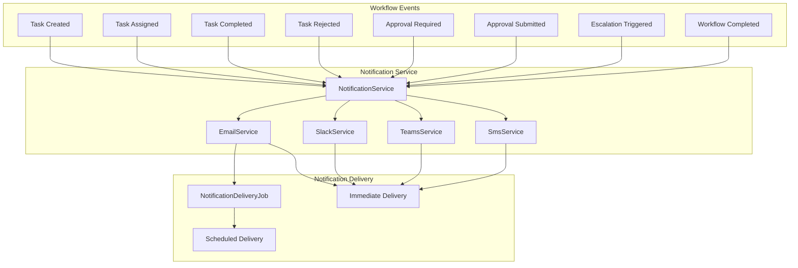
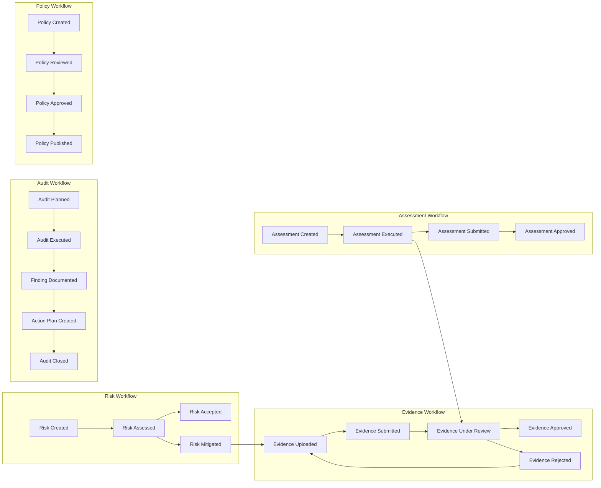
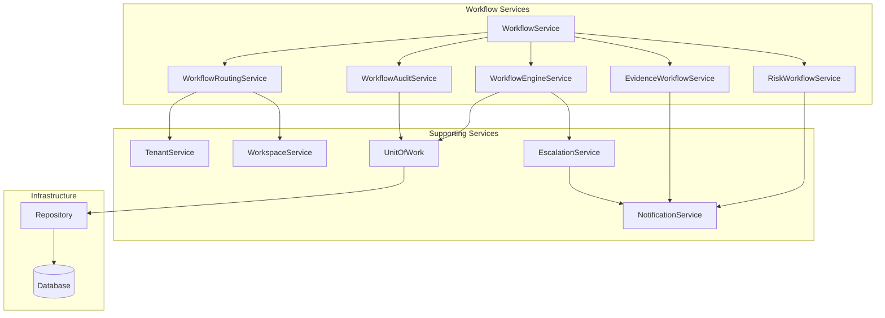
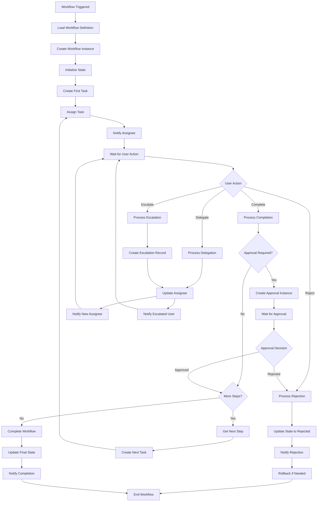
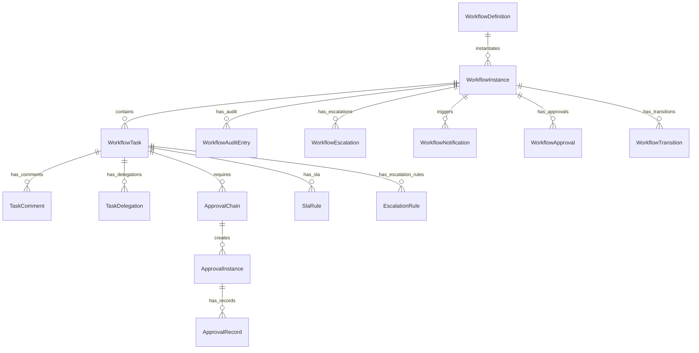
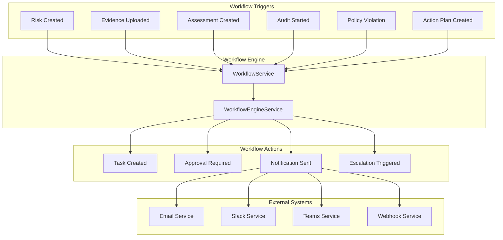

# Workflow System - Feature Connection Diagrams
## Workflow Engine, Task Routing, Approvals, and Escalations

**Generated:** 2025-01-07  
**Focus:** Workflow system architecture and connections  

---

## 1. Workflow Engine Architecture



---

## 2. Workflow Execution Flow



---

## 3. Task Assignment and Routing



---

## 4. Approval Chain Flow

```mermaid
stateDiagram-v2
    [*] --> TaskCreated: Create Task
    TaskCreated --> ApprovalRequired: Approval Needed?
    
    ApprovalRequired --> ApprovalChainCreated: Create Approval Chain
    ApprovalChainCreated --> ApprovalInstanceCreated: Create Approval Instance
    
    ApprovalInstanceCreated --> PendingApproval: Wait for Approval
    PendingApproval --> ApprovalSubmitted: User Submits
    
    ApprovalSubmitted --> CheckAllApprovers{All Approvers<br/>Approved?}
    CheckAllApprovers -->|No| PendingApproval: Wait for More
    CheckAllApprovers -->|Yes| AllApproved: All Approved
    
    AllApproved --> ApprovalRecorded: Record Approval
    ApprovalRecorded --> TaskApproved: Task Approved
    TaskApproved --> WorkflowContinues: Continue Workflow
    
    ApprovalSubmitted --> Rejected: User Rejects
    Rejected --> RejectionRecorded: Record Rejection
    RejectionRecorded --> TaskRejected: Task Rejected
    TaskRejected --> WorkflowRollback: Rollback Workflow
    
    WorkflowContinues --> [*]
    WorkflowRollback --> [*]
```

---

## 5. Escalation Path



---

## 6. Workflow → Notification Connections



---

## 7. Workflow Types and Their Connections



---

## 8. Workflow State Transitions

```mermaid
stateDiagram-v2
    [*] --> Draft: Create
    Draft --> InProgress: Start
    InProgress --> TaskAssigned: Assign Task
    TaskAssigned --> InReview: Submit for Review
    InReview --> Approved: Approve
    InReview --> Rejected: Reject
    Rejected --> TaskAssigned: Reassign
    Approved --> MoreTasks{More Tasks?}
    MoreTasks -->|Yes| TaskAssigned: Next Task
    MoreTasks -->|No| Completed: All Complete
    Completed --> [*]
    
    InProgress --> Escalated: SLA Expired
    Escalated --> TaskAssigned: Reassign
    TaskAssigned --> Overdue: Timeout
    Overdue --> Escalated: Escalate
```

---

## 9. Workflow Service Dependencies



---

## 10. Complete Workflow Lifecycle



---

## 11. Workflow Entity Relationships



---

## 12. Workflow Integration Points



---

**Last Updated:** 2025-01-07  
**Next:** See [DIAGRAMS_TENANT_RBAC.md](./DIAGRAMS_TENANT_RBAC.md) for multi-tenancy and RBAC flows
