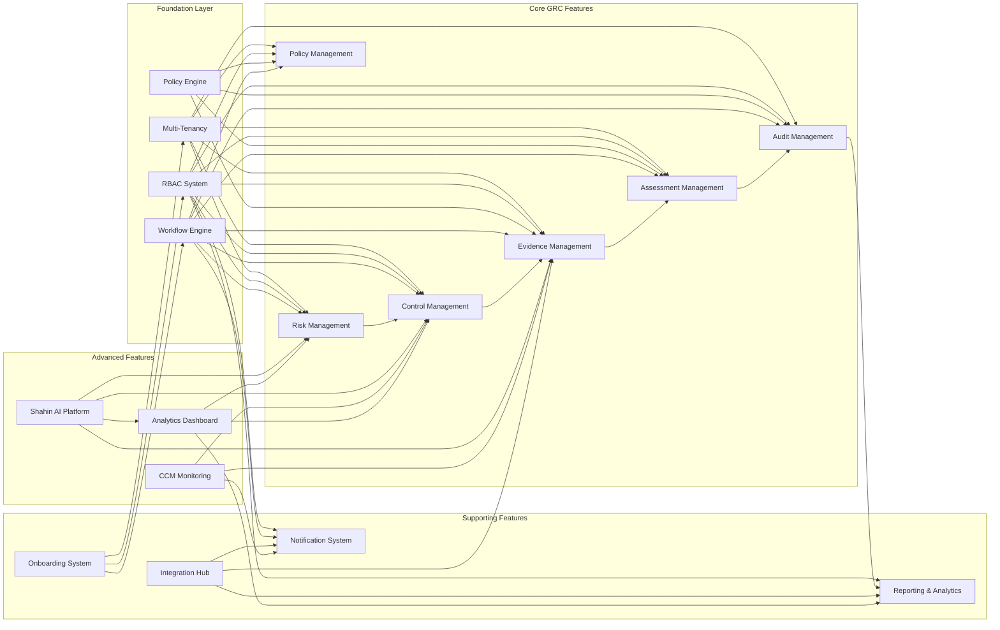
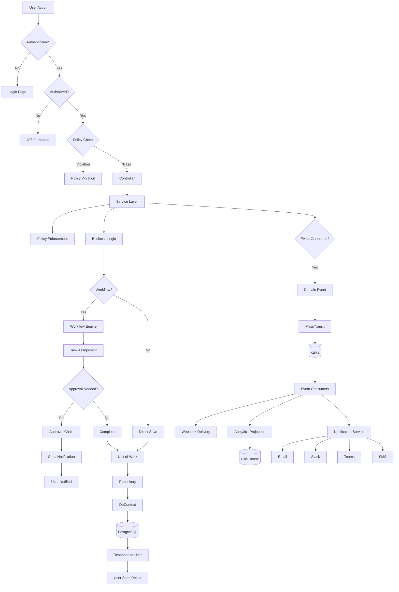
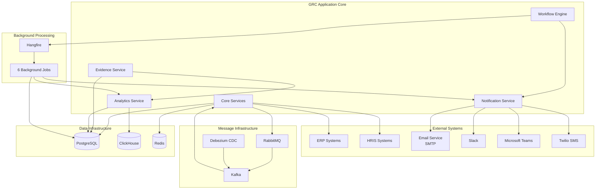
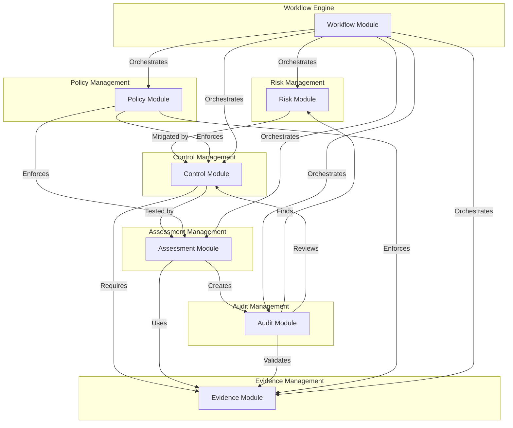
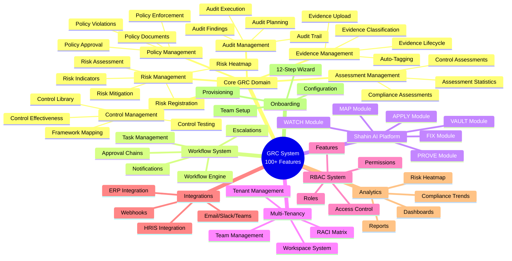
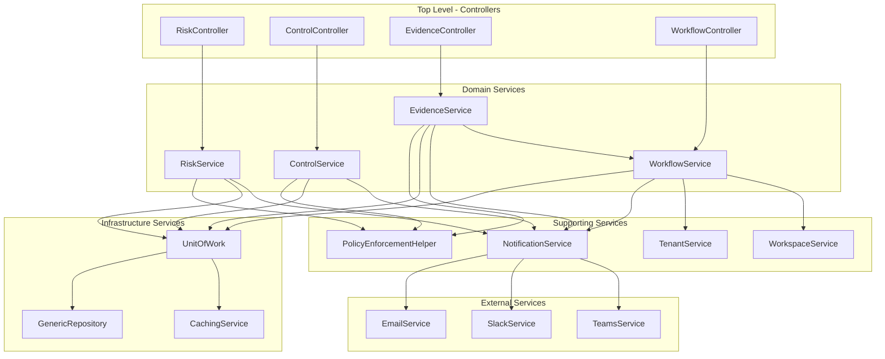
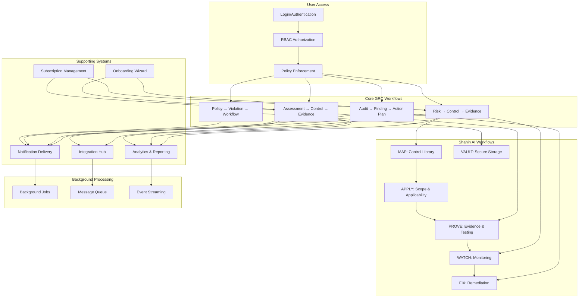

# GRC System - Feature Connection Overview
## High-Level Architecture and Feature Dependencies

**Generated:** 2025-01-07  
**Purpose:** Visual overview of how all GRC system features connect and interact  

---

## 1. Complete System Architecture

```mermaid
graph TB
    subgraph "User Interface Layer"
        Browser[Web Browser]
        Mobile[Mobile App]
        API_Client[API Clients]
    end
    
    subgraph "Presentation Layer"
        MVC[81 MVC Controllers]
        API[24 API Controllers]
        Views[254 Razor Views]
        Blazor[56 Blazor Components]
    end
    
    subgraph "Core GRC Domain - 18 Modules"
        Risk[Risk Management]
        Control[Control Management]
        Evidence[Evidence Management]
        Assessment[Assessment Management]
        Audit[Audit Management]
        Policy[Policy Management]
        Workflow[Workflow Engine]
        ActionPlan[Action Plans]
        Compliance[Compliance Calendar]
        Framework[Regulatory Frameworks]
        Regulator[Regulators]
        Vendor[Vendor Management]
        Report[Reports & Analytics]
        Plan[Plans & Phases]
        Subscription[Subscriptions]
        Notification[Notifications]
        Integration[Integrations]
        Help[Help & Support]
    end
    
    subgraph "Shahin AI Platform - 6 Modules"
        MAP[MAP Module<br/>Control Library]
        APPLY[APPLY Module<br/>Scope & Applicability]
        PROVE[PROVE Module<br/>Evidence & Testing]
        WATCH[WATCH Module<br/>Monitoring & Alerts]
        FIX[FIX Module<br/>Remediation]
        VAULT[VAULT Module<br/>Secure Storage]
    end
    
    subgraph "Specialized Modules"
        CCM[CCM<br/>Continuous Control Monitoring]
        KRI[KRI Dashboard<br/>Risk Indicators]
        Onboarding[12-Step Onboarding Wizard]
        PlatformAdmin[Platform Administration]
    end
    
    subgraph "Application Layer - 182 Services"
        DomainServices[Domain Services]
        WorkflowServices[Workflow Services]
        TenantServices[Tenant Services]
        RBACServices[RBAC Services]
        NotificationServices[Notification Services]
        IntegrationServices[Integration Services]
        AnalyticsServices[Analytics Services]
    end
    
    subgraph "Policy & Security"
        PolicyEngine[Policy Engine<br/>YAML-based]
        Permissions[Permission System<br/>40+ Permissions]
        RBAC[RBAC System]
    end
    
    subgraph "Data Access Layer"
        UnitOfWork[Unit of Work]
        Repository[Generic Repository]
        DbContext[GrcDbContext<br/>189 DbSets]
        AuthDbContext[GrcAuthDbContext<br/>Identity]
    end
    
    subgraph "Background Processing"
        Hangfire[6 Background Jobs]
        MassTransit[MassTransit<br/>Message Queue]
    end
    
    subgraph "Infrastructure"
        PostgreSQL[(PostgreSQL<br/>GrcMvcDb)]
        AuthDB[(PostgreSQL<br/>GrcAuthDb)]
        Redis[(Redis Cache)]
        ClickHouse[(ClickHouse OLAP)]
        Kafka[(Kafka + Debezium)]
    end
    
    Browser --> MVC
    Browser --> Views
    Browser --> Blazor
    Mobile --> API
    API_Client --> API
    
    MVC --> Risk
    MVC --> Control
    MVC --> Evidence
    MVC --> Assessment
    MVC --> Audit
    MVC --> Policy
    MVC --> Workflow
    MVC --> MAP
    MVC --> APPLY
    MVC --> PROVE
    MVC --> WATCH
    MVC --> FIX
    MVC --> VAULT
    MVC --> CCM
    MVC --> Onboarding
    MVC --> PlatformAdmin
    
    API --> DomainServices
    API --> WorkflowServices
    API --> AnalyticsServices
    
    Risk --> DomainServices
    Control --> DomainServices
    Evidence --> DomainServices
    Assessment --> DomainServices
    Audit --> DomainServices
    Policy --> DomainServices
    Workflow --> WorkflowServices
    
    MAP --> DomainServices
    APPLY --> DomainServices
    PROVE --> DomainServices
    WATCH --> DomainServices
    FIX --> DomainServices
    VAULT --> DomainServices
    
    DomainServices --> PolicyEngine
    DomainServices --> Permissions
    DomainServices --> RBAC
    DomainServices --> UnitOfWork
    
    WorkflowServices --> NotificationServices
    WorkflowServices --> TenantServices
    
    UnitOfWork --> Repository
    Repository --> DbContext
    Repository --> AuthDbContext
    
    DbContext --> PostgreSQL
    AuthDbContext --> AuthDB
    
    DomainServices --> Hangfire
    DomainServices --> MassTransit
    
    Hangfire --> PostgreSQL
    MassTransit --> Kafka
    AnalyticsServices --> ClickHouse
    DomainServices --> Redis
```

---

## 2. Feature Dependency Graph

---

## 3. Data Flow Overview

---

## 4. Integration Points Map

---

## 5. Module Interaction Matrix

---

## 6. Feature Categories Overview

---

## 7. Service Dependency Hierarchy

---

## 8. Complete Feature Map

---

## 9. Feature Connection Summary

### Primary Connections

1. **Risk → Control → Evidence → Assessment → Audit**
   - Risks are mitigated by Controls
   - Controls require Evidence
   - Controls are tested by Assessments
   - Assessments use Evidence
   - Audits validate all of the above

2. **Policy → All GRC Modules**
   - Policy engine enforces rules on Evidence, Assessment, Control, Risk
   - Policy violations trigger Workflows

3. **Workflow → All GRC Modules**
   - Workflow engine orchestrates Risk, Control, Evidence, Assessment, Audit, Policy workflows
   - Workflows trigger Notifications

4. **RBAC → All Features**
   - Permissions control access to all 18 modules
   - Features determine menu visibility
   - Roles grant permissions

5. **Multi-Tenancy → All Features**
   - All data is tenant-scoped
   - Workspaces provide sub-scoping
   - Teams organize users within workspaces

6. **Shahin AI → Core GRC**
   - MAP provides control library
   - APPLY determines scope
   - PROVE manages evidence
   - WATCH monitors risks
   - FIX handles remediation
   - VAULT secures documents

7. **Onboarding → Provisioning → Configuration**
   - 12-step wizard creates tenant
   - Provisions database and workspace
   - Configures teams, workflows, and integrations

8. **Events → Consumers → Actions**
   - Domain events published to Kafka
   - Consumers trigger webhooks, notifications, analytics
   - Background jobs process async tasks

---

## 10. Navigation to Detailed Diagrams

For detailed feature connection diagrams, see:

1. **[DIAGRAMS_CORE_GRC.md](./DIAGRAMS_CORE_GRC.md)** - Core GRC domain feature connections
2. **[DIAGRAMS_WORKFLOW_SYSTEM.md](./DIAGRAMS_WORKFLOW_SYSTEM.md)** - Workflow system connections
3. **[DIAGRAMS_TENANT_RBAC.md](./DIAGRAMS_TENANT_RBAC.md)** - Multi-tenancy and RBAC flows
4. **[DIAGRAMS_SHAHIN_AI.md](./DIAGRAMS_SHAHIN_AI.md)** - Shahin AI platform architecture
5. **[DIAGRAMS_INTEGRATIONS.md](./DIAGRAMS_INTEGRATIONS.md)** - Integration and service connections
6. **[DIAGRAMS_ONBOARDING.md](./DIAGRAMS_ONBOARDING.md)** - Onboarding system flows
7. **[DIAGRAMS_DATA_FLOWS.md](./DIAGRAMS_DATA_FLOWS.md)** - Data flow patterns

---

**Last Updated:** 2025-01-07
