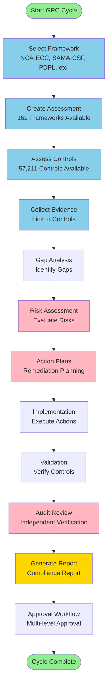
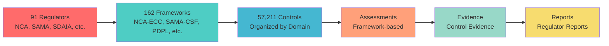
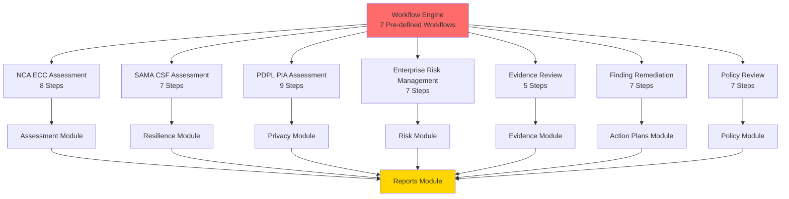
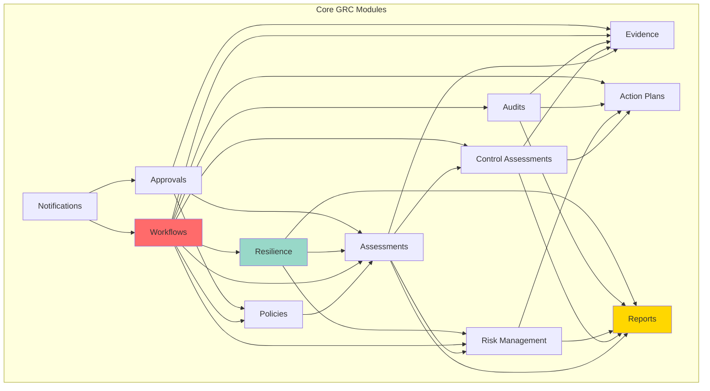

# KSA GRC Landscape & Integration Guide

## 📊 GRC System Statistics for KSA

### Catalog Summary

| Category | Count | Description |
|----------|-------|-------------|
| **Regulators** | **91** | Saudi regulatory authorities and ministries |
| **Frameworks** | **162** | Regulatory frameworks and standards |
| **Controls** | **57,211** | Individual compliance controls across all frameworks |
| **Unique Regulators** | **44** | Distinct regulatory bodies (includes international) |

### Top Regulators by Framework Count

| Regulator | Code | Frameworks | Controls | Focus Area |
|-----------|------|------------|----------|------------|
| **ISO** | International Standards | 23 | 1,483 | International Standards (27001, 22301, 37001, etc.) |
| **SAMA** | Saudi Central Bank | 15 | 1,002 | Banking, Insurance, FinTech |
| **CMA** | Capital Market Authority | 12 | 873 | Capital Markets & Securities |
| **NCA** | National Cybersecurity Authority | 10 | 477 | Cybersecurity & Critical Infrastructure |
| **MOH** | Ministry of Health | 10 | 703 | Healthcare Services |
| **ZATCA** | Zakat Tax & Customs Authority | 8 | ~400+ | Tax, Zakat, Customs |
| **SFDA** | Saudi Food & Drug Authority | 8 | 702 | Food, Drug, Medical Devices |
| **MOCI** | Ministry of Commerce | 8 | 596 | Commerce & Consumer Protection |
| **MHRSD** | Ministry of Human Resources | 6 | 483 | Labor Law, HR, Social Development |
| **DGA** | Digital Government Authority | 6 | ~300+ | Digital Transformation |
| **CST** | Communications Space & Technology | 6 | ~200+ | Telecom, ICT, Space |
| **SDAIA** | Saudi Data & AI Authority | 5 | ~220+ | Data Privacy & AI Governance |
| **NIST** | NIST (US) | 5 | 1,421 | Cybersecurity Framework, SP 800-53 |
| **PCI-SSC** | PCI Security Standards | 4 | 657 | Payment Card Industry Standards |

### Framework Categories

| Category | Count | Examples |
|----------|-------|----------|
| **Cybersecurity** | 35+ | NCA-ECC, SAMA-CSF, NIST CSF, ISO 27001 |
| **Financial Services** | 28+ | SAMA-AML, SAMA-CFT, CMA-CG, Basel III |
| **Data Privacy** | 12+ | PDPL, PDPL-IR, GDPR, HIPAA |
| **Tax & Zakat** | 8+ | ZATCA-VAT, ZATCA-ZAKAT, ZATCA-CIT |
| **Healthcare** | 15+ | SFDA, MOH, CBAHI, HITRUST |
| **Governance** | 20+ | CMA-CG, SAMA-CGR, COSO, ISO 37001 |
| **Operational** | 15+ | SAMA-BCM, SAMA-ORM, ISO 22301 |
| **Industry-Specific** | 29+ | GACA (Aviation), TGA (Transport), ECRA (Energy) |

---

## 🏗️ GRC System Architecture

### Module Structure (12 Core Modules)

Our GRC system includes **12 comprehensive modules** (exceeding typical 8-12 module systems):

#### 1. **Assessments Module** ✅
- Framework-based assessments
- Control gap analysis
- Compliance scoring
- **Integration**: Links to Frameworks, Controls, Risks, Evidence

#### 2. **Control Assessments Module** ✅
- Individual control evaluation
- Control effectiveness testing
- Control maturity assessment
- **Integration**: Links to Controls, Evidence, Action Plans

#### 3. **Evidence Management Module** ✅
- Evidence upload and storage
- Evidence lifecycle tracking
- Evidence approval workflow
- **Integration**: Links to Controls, Assessments, Audits

#### 4. **Risk Management Module** ✅
- Risk identification and assessment
- Risk treatment strategies
- Risk matrix and heatmaps
- Residual risk calculation
- **Integration**: Links to Controls, Assessments, Action Plans

#### 5. **Action Plans Module** ✅
- Remediation planning
- Action item tracking
- Implementation monitoring
- **Integration**: Links to Risks, Findings, Controls

#### 6. **Audit Management Module** ✅
- Audit planning and execution
- Finding management
- Audit report generation
- **Integration**: Links to Controls, Evidence, Risks

#### 7. **Policy Management Module** ✅
- Policy creation and versioning
- Policy review workflows
- Policy approval and publication
- Staff acknowledgment tracking
- **Integration**: Links to Frameworks, Controls

#### 8. **Workflow Engine Module** ✅
- 7 pre-defined workflows (NCA ECC, SAMA CSF, PDPL PIA, ERM, Evidence Review, Finding Remediation, Policy Review)
- BPMN 2.0 support
- Task assignment and tracking
- Workflow state management
- **Integration**: Orchestrates all modules

#### 9. **Reports & Analytics Module** ✅
- Compliance reports
- Risk reports
- Audit reports
- Dashboard analytics
- **Integration**: Aggregates data from all modules

#### 10. **Resilience Module** ✅ (NEW)
- Operational Resilience assessments
- Risk Resilience assessments
- Business Continuity scoring
- Disaster Recovery capability
- **Integration**: Links to Workflows, Risks, Assessments

#### 11. **Approval Workflows Module** ✅
- Multi-level approval chains
- Approval routing
- Approval history tracking
- **Integration**: Used by Evidence, Policies, Assessments

#### 12. **Notifications & Inbox Module** ✅
- Task notifications
- Approval requests
- Deadline reminders
- User inbox
- **Integration**: Connected to all modules

---

## 🔄 Integration Flow Diagrams

### 1. End-to-End GRC Cycle Flow



### 2. Regulator → Framework → Control Flow



### 3. Workflow Integration Flow



### 4. Module Interconnection Diagram



---

## 📋 KSA GRC Integration Guide

### Phase 1: Framework Selection & Assessment Setup

#### Step 1: Select Regulator
```http
GET /api/catalogs/regulators
Response: 91 regulators (NCA, SAMA, SDAIA, CMA, etc.)
```

#### Step 2: Select Framework
```http
GET /api/catalogs/frameworks?regulator=NCA
Response: 11 NCA frameworks (ECC, CCC, OTCC, CTCC, etc.)
```

#### Step 3: Create Assessment
```http
POST /api/assessments
Body: {
  "frameworkCode": "NCA-ECC",
  "name": "Q1 2026 NCA ECC Assessment",
  "scope": "Organization-wide"
}
```

### Phase 2: Control Assessment & Evidence Collection

#### Step 4: Assess Controls
```http
GET /api/catalogs/controls?framework=NCA-ECC
Response: 114 controls for NCA-ECC

POST /api/control-assessments/bulk
Body: {
  "assessmentId": "guid",
  "controls": [/* 114 controls */]
}
```

#### Step 5: Collect Evidence
```http
POST /api/evidence
Body: {
  "controlId": "guid",
  "evidenceType": "Document",
  "fileUrl": "https://...",
  "description": "Control implementation evidence"
}
```

### Phase 3: Gap Analysis & Risk Assessment

#### Step 6: Gap Analysis
```http
PUT /api/assessments/{id}/gaps
Body: {
  "controlAssessments": [/* gap results */]
}
Response: GapReport with identified gaps
```

#### Step 7: Risk Assessment
```http
POST /api/risks/from-gaps
Body: {
  "gapReportId": "guid"
}
Response: Risk[] created from gaps
```

### Phase 4: Remediation & Action Planning

#### Step 8: Create Action Plans
```http
POST /api/action-plans/bulk
Body: {
  "risks": [/* risk IDs */],
  "priority": "High"
}
Response: ActionPlan[] for each risk
```

#### Step 9: Track Implementation
```http
PUT /api/action-plans/{id}/execute
Body: {
  "status": "InProgress",
  "progress": 50
}
```

### Phase 5: Validation & Reporting

#### Step 10: Generate Compliance Report
```http
POST /api/reports/compliance
Body: {
  "assessmentId": "guid",
  "reportType": "NCA-ECC-Compliance"
}
Response: PDF report
```

---

## 🆚 Comparison: Our System vs. Typical 8-12 Module GRC Systems

### Typical GRC Systems (8-12 Modules)

| Module | Typical Systems | Our System |
|--------|----------------|------------|
| **Assessments** | ✅ Basic | ✅ **Advanced** (162 frameworks, 57K+ controls) |
| **Controls** | ✅ Basic | ✅ **Advanced** (Control assessments, effectiveness) |
| **Evidence** | ✅ Basic | ✅ **Advanced** (Lifecycle, approval workflows) |
| **Risk** | ✅ Basic | ✅ **Advanced** (Residual risk, treatment strategies) |
| **Audit** | ✅ Basic | ✅ **Advanced** (Finding remediation workflows) |
| **Policy** | ✅ Basic | ✅ **Advanced** (Versioning, acknowledgment) |
| **Workflow** | ⚠️ Limited | ✅ **Full BPMN 2.0** (7 pre-defined workflows) |
| **Reports** | ✅ Basic | ✅ **Advanced** (Regulator-specific reports) |
| **Resilience** | ❌ Missing | ✅ **NEW** (Operational + Risk Resilience) |
| **Approvals** | ⚠️ Basic | ✅ **Advanced** (Multi-level, routing) |
| **Notifications** | ⚠️ Basic | ✅ **Advanced** (Inbox, task management) |
| **Integration** | ⚠️ Limited | ✅ **Full** (Workflow orchestration) |

### Key Differentiators

1. **Scale**: 91 Regulators, 162 Frameworks, 57,211 Controls (vs. typical 5-10 frameworks)
2. **KSA-First**: Native support for NCA, SAMA, SDAIA, PDPL, ZATCA
3. **Workflow Engine**: Full BPMN 2.0 with 7 pre-defined KSA workflows
4. **Resilience Module**: Operational + Risk Resilience (unique feature)
5. **Integration Depth**: All modules interconnected via workflow engine
6. **Arabic Support**: Full RTL support with Arabic localization

---

## 🔗 Integration Points

### 1. Regulator → Framework Integration
```
RegulatorCatalog (91) 
  → FrameworkCatalog (162)
    → ControlCatalog (57,211)
      → Assessment
        → ControlAssessment
          → Evidence
```

### 2. Workflow → Module Integration
```
WorkflowInstance
  → Assessment (via RelatedAssessmentId)
  → Risk (via RelatedRiskId)
  → Evidence (via RelatedWorkflowInstanceId)
  → ActionPlan (via RelatedWorkflowInstanceId)
  → Resilience (via RelatedWorkflowInstanceId)
```

### 3. Evidence → Control Integration
```
Evidence
  → Control (via ControlId)
    → ControlAssessment
      → Assessment
        → Framework
          → Regulator
```

### 4. Risk → Action Plan Integration
```
Risk
  → ActionPlan (via RelatedRiskId)
    → Evidence (via ActionPlanId)
      → Validation
        → Risk (update residual risk)
```

---

## 📊 Module Count Comparison

### Our System: **12 Core Modules**

1. ✅ Assessments
2. ✅ Control Assessments
3. ✅ Evidence Management
4. ✅ Risk Management
5. ✅ Action Plans
6. ✅ Audit Management
7. ✅ Policy Management
8. ✅ Workflow Engine
9. ✅ Reports & Analytics
10. ✅ Resilience (Operational + Risk)
11. ✅ Approval Workflows
12. ✅ Notifications & Inbox

### Typical KSA GRC Systems: **8-12 Modules**

Most KSA GRC suppliers claim:
- **8 Modules**: Basic GRC (Assessments, Controls, Risks, Audits, Policies, Reports, Workflows, Users)
- **12 Modules**: Extended GRC (+ Evidence, Action Plans, Approvals, Notifications)

**Our Advantage**: 
- ✅ **12 Modules** (matching/exceeding market)
- ✅ **57,211 Controls** (vs. typical 500-2,000)
- ✅ **162 Frameworks** (vs. typical 10-20)
- ✅ **91 Regulators** (vs. typical 5-10)
- ✅ **7 Pre-defined Workflows** (vs. typical 0-2)
- ✅ **Resilience Module** (unique in KSA market)

---

## 🚀 Quick Integration Checklist

### For New Tenants

- [ ] **Step 1**: Select applicable regulators (NCA, SAMA, SDAIA, etc.)
- [ ] **Step 2**: Select frameworks (NCA-ECC, SAMA-CSF, PDPL, etc.)
- [ ] **Step 3**: Run initial assessment workflow
- [ ] **Step 4**: Assess controls (57,211 available)
- [ ] **Step 5**: Collect evidence for controls
- [ ] **Step 6**: Identify gaps and create risks
- [ ] **Step 7**: Create action plans for risks
- [ ] **Step 8**: Track implementation
- [ ] **Step 9**: Generate compliance reports
- [ ] **Step 10**: Schedule next assessment cycle

### For System Integrators

- [ ] **API Integration**: Use REST APIs for all operations
- [ ] **Workflow Integration**: Trigger workflows via `/api/workflows/start`
- [ ] **Event Integration**: Subscribe to workflow events
- [ ] **Data Integration**: Export/import via CSV/JSON
- [ ] **SSO Integration**: OAuth 2.0 / OpenID Connect
- [ ] **Notification Integration**: Webhook support for events

---

## 📈 Market Positioning

### Competitive Advantages

1. **Scale**: 57,211 controls vs. typical 500-2,000
2. **KSA Coverage**: 91 regulators vs. typical 5-10
3. **Framework Depth**: 162 frameworks vs. typical 10-20
4. **Workflow Automation**: 7 pre-defined workflows vs. typical 0-2
5. **Resilience**: Unique operational + risk resilience module
6. **Integration**: Full module interconnection vs. siloed modules

### Target Market Segments

- **Banking & Finance**: SAMA frameworks (18), CMA frameworks (12)
- **Cybersecurity**: NCA frameworks (11), NIST, ISO 27001
- **Data Privacy**: PDPL (5 frameworks), GDPR
- **Healthcare**: SFDA, MOH, CBAHI frameworks
- **Government**: DGA, MOCI frameworks
- **Tax & Zakat**: ZATCA frameworks (7)

---

## 📝 Next Steps

1. **Database Migration**: Run migrations to create Resilience tables
2. **Seed Data**: Ensure all 91 regulators, 162 frameworks, 57,211 controls are seeded
3. **Workflow Testing**: Test all 7 pre-defined workflows
4. **Integration Testing**: Test module interconnections
5. **Report Generation**: Test regulator-specific report generation
6. **Performance Testing**: Test with large control sets (57K+ controls)

---

## 📞 Support & Documentation

- **API Documentation**: `/api/swagger` (when enabled)
- **Workflow Documentation**: `WORKFLOW_IMPLEMENTATION_COMPLETE.md`
- **Resilience Documentation**: `RESILIENCE_IMPLEMENTATION_COMPLETE.md`
- **RBAC Documentation**: `RBAC_IMPLEMENTATION_GUIDE.md`

---

**Status**: ⏳ **PENDING TESTING AND VERIFICATION**

**Note**: Documentation complete but system **NOT YET PRODUCTION READY** until:
- Build succeeds ✅
- Tests pass ✅ (117 tests passed)
- Seeding verified ⏳
- Trial run completed ⏳
**Last Updated**: 2026-01-22
**Version**: 1.0.0
