# GRC System - Structure Diagrams
## Visual Architecture and Code Structure Documentation

**Generated:** 2025-01-07  
**Based on:** Actual code analysis  

---

## 1. High-Level Architecture Diagram

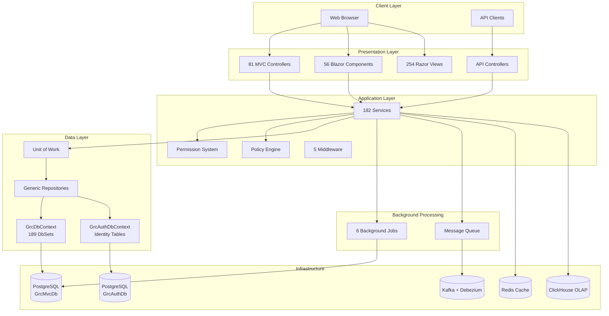

---

## 2. Directory Structure Tree

```
src/GrcMvc/
│
├── 📁 Application/              (23 files)
│   ├── Permissions/            (7 files)
│   │   ├── GrcPermissions.cs
│   │   ├── PermissionDefinitionProvider.cs
│   │   └── ...
│   └── Policy/                  (16 files)
│       ├── PolicyEnforcer.cs
│       ├── PolicyStore.cs
│       └── ...
│
├── 📁 Controllers/              (81 files)
│   ├── AccountController.cs
│   ├── AdminController.cs
│   ├── DashboardController.cs
│   ├── RiskController.cs
│   ├── ControlController.cs
│   ├── EvidenceController.cs
│   ├── WorkflowController.cs
│   └── Api/                    (24 API controllers)
│       ├── RiskApiController.cs
│       ├── EvidenceApiController.cs
│       └── ...
│
├── 📁 Services/                 (182 files)
│   ├── Interfaces/              (75 interfaces)
│   │   ├── IRiskService.cs
│   │   ├── IControlService.cs
│   │   ├── IWorkflowService.cs
│   │   └── ...
│   └── Implementations/         (107 implementations)
│       ├── RiskService.cs
│       ├── ControlService.cs
│       ├── WorkflowService.cs
│       ├── RBAC/               (RBAC services)
│       └── Workflows/          (Workflow services)
│
├── 📁 Models/                   (124 files)
│   ├── Entities/                (80 entity files)
│   │   ├── Risk.cs
│   │   ├── Control.cs
│   │   ├── Evidence.cs
│   │   ├── Workflow*.cs
│   │   └── ...
│   ├── DTOs/                    (24 DTO files)
│   │   ├── RiskDto.cs
│   │   ├── ControlDto.cs
│   │   └── ...
│   └── ViewModels/              (3 files)
│
├── 📁 Data/                     
│   ├── GrcDbContext.cs          (189 DbSets)
│   ├── GrcAuthDbContext.cs     (Identity tables)
│   ├── IUnitOfWork.cs
│   ├── UnitOfWork.cs
│   ├── Repositories/
│   ├── Migrations/              (36+ migrations)
│   └── Seeds/                   (Seed data)
│
├── 📁 Views/                    (254 .cshtml files)
│   ├── Home/
│   ├── Dashboard/
│   ├── Risk/
│   ├── Control/
│   ├── Evidence/
│   └── ...
│
├── 📁 Components/               (56 .razor files)
│   └── Shared/
│
├── 📁 Middleware/                (5 files)
│   ├── TenantResolutionMiddleware.cs
│   ├── SecurityHeadersMiddleware.cs
│   └── ...
│
├── 📁 BackgroundJobs/            (6 files)
│   ├── NotificationDeliveryJob.cs
│   ├── EscalationJob.cs
│   └── ...
│
└── 📁 wwwroot/                  (Static files)
    ├── css/
    ├── js/
    └── lib/
```

---

## 3. Database Entity Relationship Overview

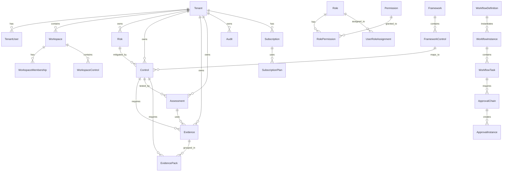

---

## 4. Service Layer Architecture

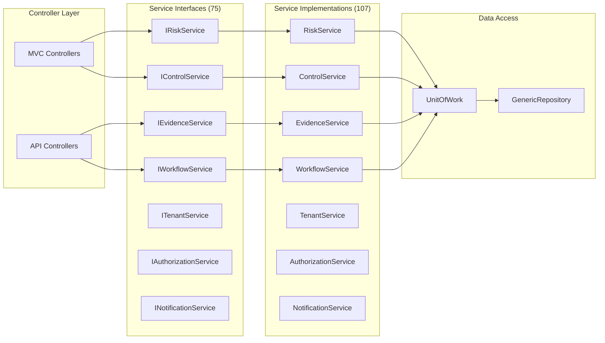

---

## 5. Multi-Tenancy Architecture

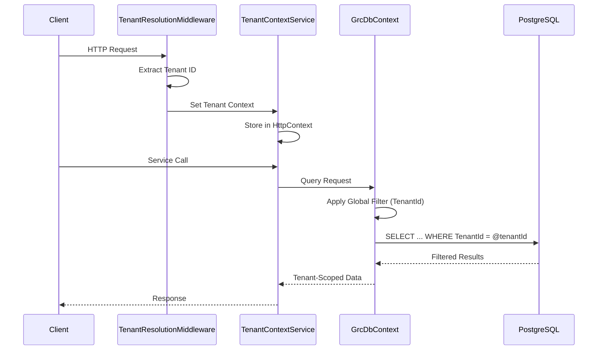

---

## 6. Request Flow Diagram

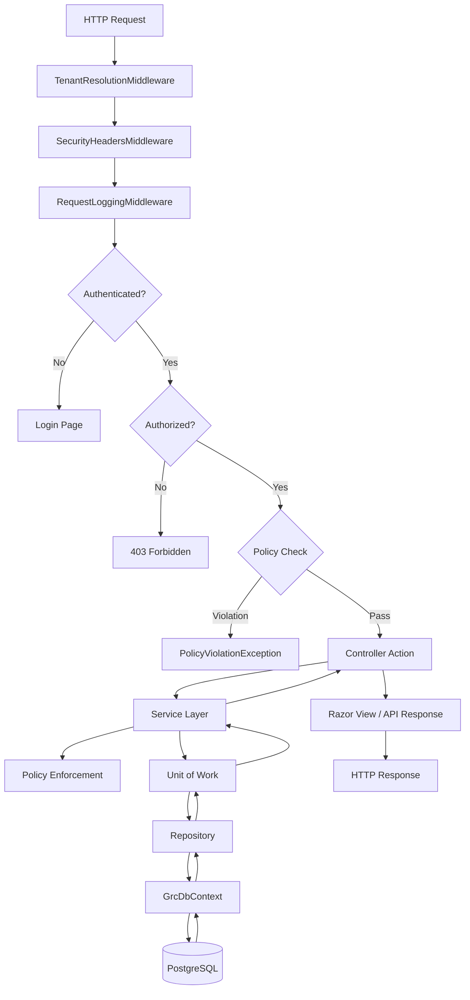

---

## 7. Background Job Architecture

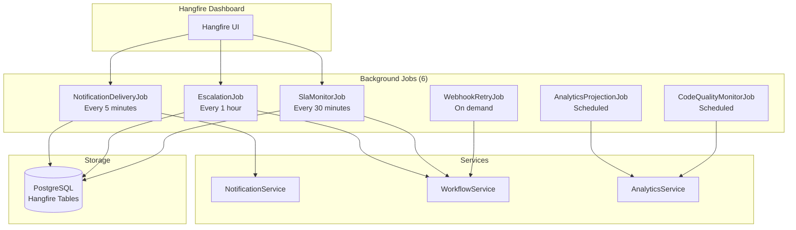

---

## 8. Database Schema Overview

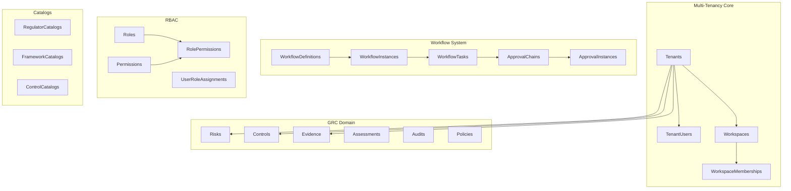

---

## 9. Controller Organization

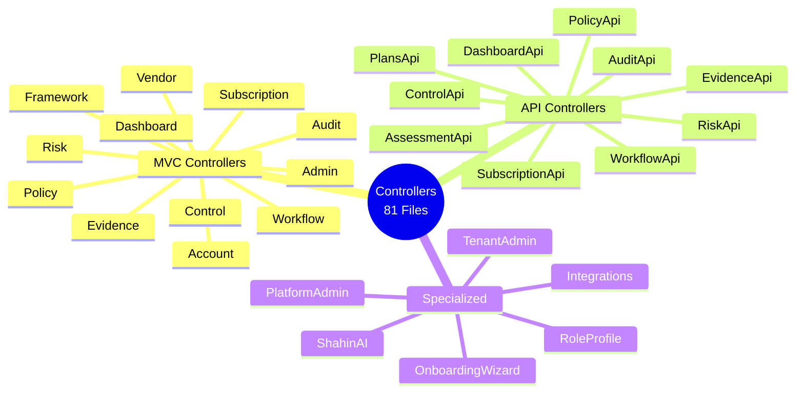

---

## 10. Service Dependency Graph

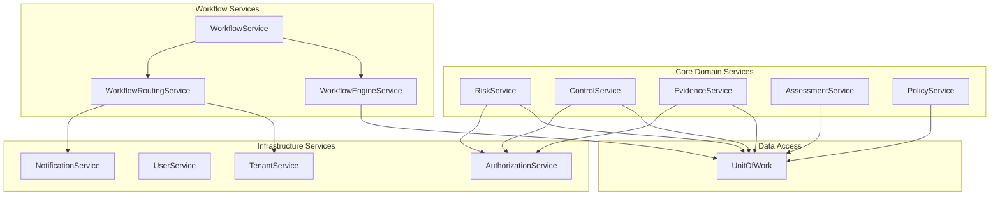

---

## 11. Policy Engine Flow

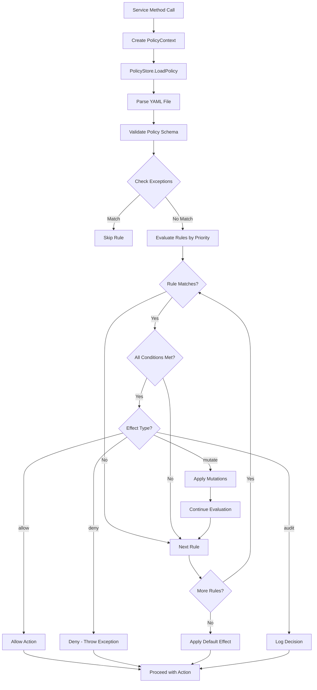

---

## 12. Entity Count by Category

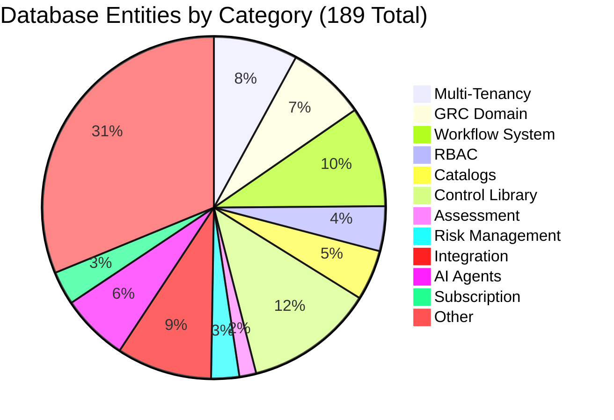

---

## 13. File Distribution

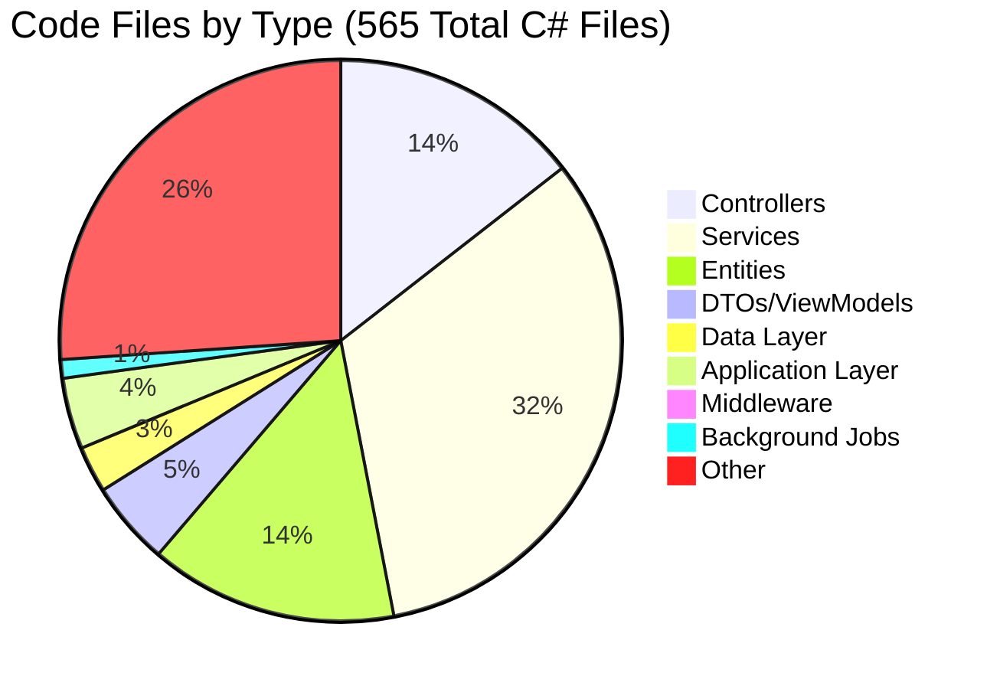

---

## 14. Technology Stack Layers

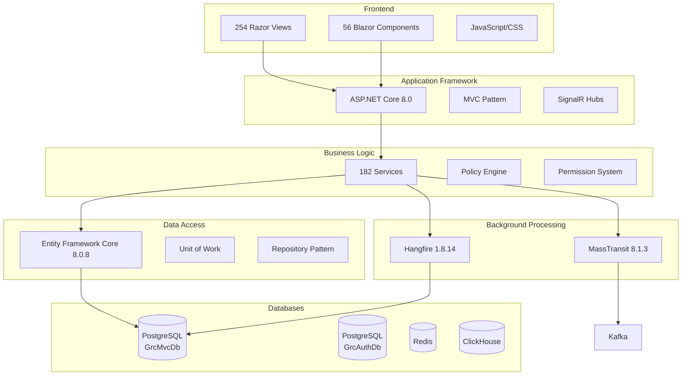

---

## 15. Authentication & Authorization Flow

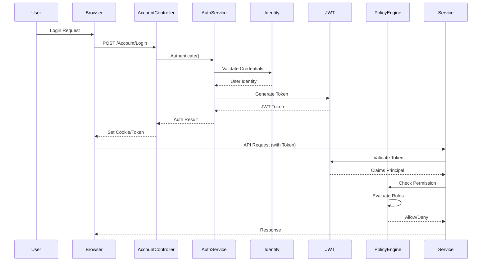

---

## 16. Workflow Execution Flow

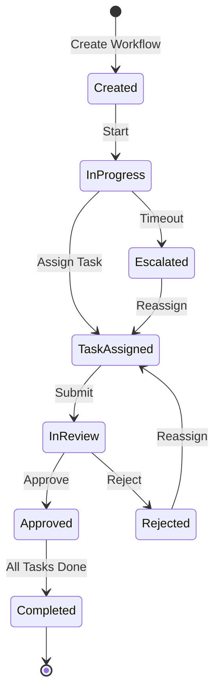

---

## 17. Docker Services Architecture

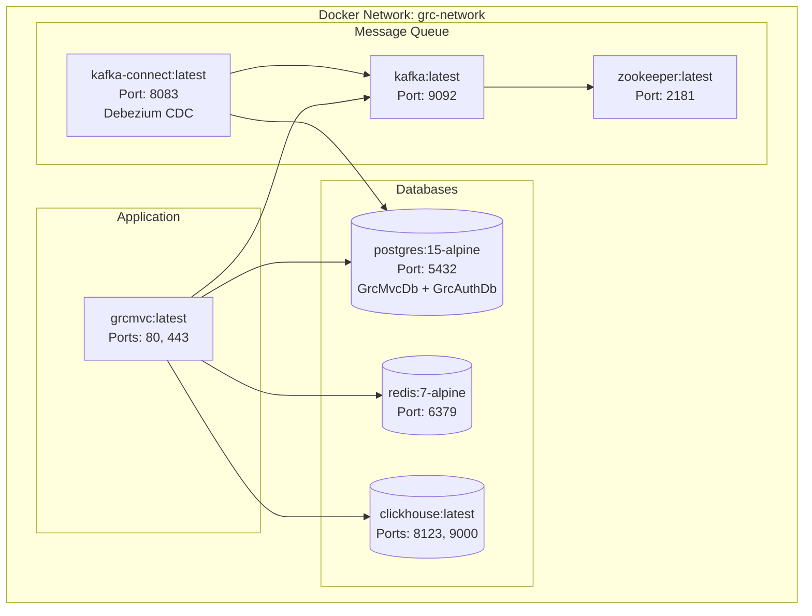

---

## 18. Data Flow: Evidence Upload

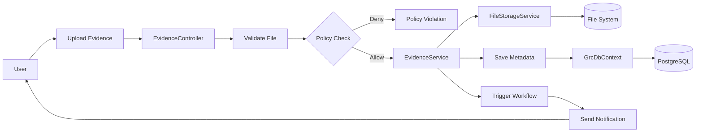

---

## 19. Component Size Distribution

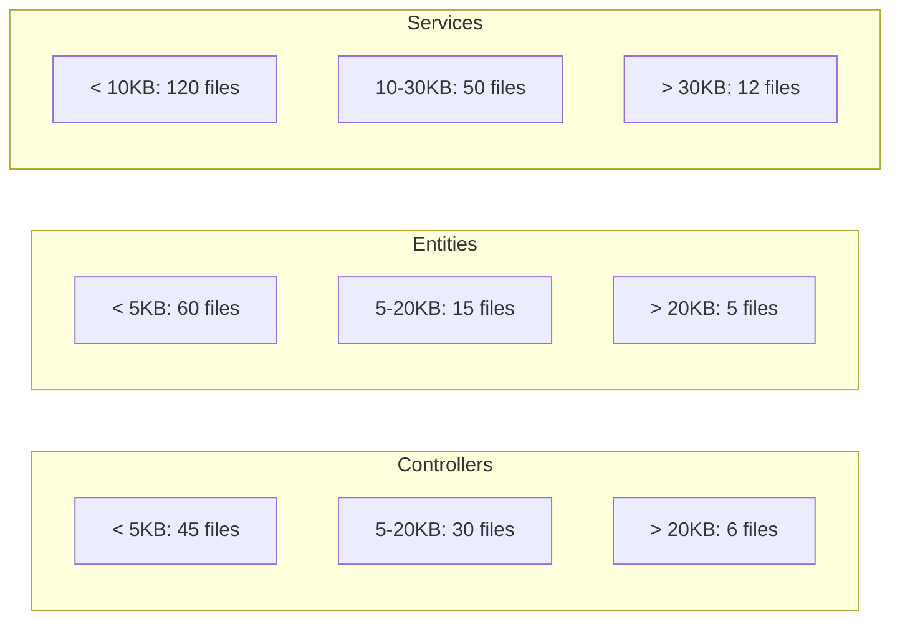

---

## 20. Integration Points

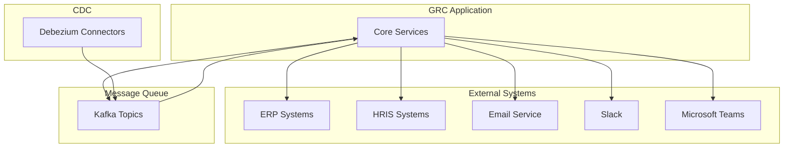

---

## Diagram Legend

### Symbols Used:
- 📁 = Directory/Folder
- [ ] = Component/Class
- ( ) = Database/Storage
- { } = Decision Point
- --> = Flow/Dependency
- ||--o{ = One-to-Many Relationship

### Colors (in rendered Mermaid):
- Blue = Controllers/API Layer
- Green = Services/Business Logic
- Orange = Data Access Layer
- Purple = Infrastructure
- Yellow = Background Processing

---

## How to View These Diagrams

1. **Mermaid Diagrams**: 
   - View in GitHub (renders automatically)
   - Use [Mermaid Live Editor](https://mermaid.live)
   - VS Code with Mermaid extension
   - Markdown viewers with Mermaid support

2. **ASCII Diagrams**: 
   - View directly in text editor
   - Use monospace font for alignment

3. **Export Options**:
   - Mermaid diagrams can be exported as PNG/SVG
   - Use online tools or VS Code extensions

---

**Note:** All diagrams are based on actual code structure analysis, not documentation assumptions.
